# Voland — Design Document

A Nintendo Switch emulator targeting the web as a primary platform, with native apps on iOS, Android, macOS, tvOS, visionOS, Windows, and Linux.

---

## Table of Contents

1. [Project Overview](#1-project-overview)
   - 1.5 [Non-Goals](#15-non-goals)
   - 1.6 [Legal Scope Boundaries](#16-legal-scope-boundaries)
2. [Repository Structure](#2-repository-structure)
3. [Core Principles](#3-core-principles)
4. [Memory Architecture](#4-memory-architecture)
5. [Guest Virtual Memory (Softmmu)](#5-guest-virtual-memory-softmmu)
6. [Threading Model](#6-threading-model)
7. [Guest Thread Scheduling](#7-guest-thread-scheduling)
8. [CPU Backend Interface](#8-cpu-backend-interface)
9. [No-Op Backend](#9-no-op-backend)
10. [Ballistic Integration Plan](#10-ballistic-integration-plan)
11. [JIT Compilation Pipeline](#11-jit-compilation-pipeline)
12. [HLE Service Layer](#12-hle-service-layer)
13. [GPU Architecture](#13-gpu-architecture)
14. [Audio Pipeline](#14-audio-pipeline)
15. [Storage Architecture](#15-storage-architecture)
16. [Web Platform Layer](#16-web-platform-layer)
17. [Native Platform Layers](#17-native-platform-layers)
18. [Input Handling](#18-input-handling)
19. [Mod System](#19-mod-system)
20. [Multiplayer & Companion Server](#20-multiplayer--companion-server)
21. [Amiibo](#21-amiibo)
22. [Companion App](#22-companion-app)
23. [Developer Tooling](#23-developer-tooling)
24. [Build System](#24-build-system)
25. [Development Phases](#25-development-phases)
26. [Contributing](#26-contributing)
27. [Reference Implementations](#27-reference-implementations)
28. [Risk Register](#28-risk-register)

---

## 1. Project Overview

A Nintendo Switch 1 (and eventually Switch 2) emulator targeting all major platforms from a single C core. The primary innovation is a WASM-first architecture enabling browser-based emulation with zero installation friction. Secondary targets are iOS, Android, desktop, and living room platforms.

### Design goals in priority order

1. **Correct**, games run as they do on hardware
2. **Portable**, one C core, all platforms
3. **Web-first**, browser is a first-class target, not an afterthought
4. **Fast**, playable frame rates on consumer hardware
5. **Open**, no proprietary dependencies in core

### What makes this different from existing emulators

- WASM as a primary JIT emission target, not a port
- WebGPU renderer built from the start, not retrofitted
- CPU backend is an abstract vtable, the recompiler (Ballistic) slots in when ready, interpreter used until then
- All platform layers are thin, the C core does the work, platforms provide surfaces
- Web version is not a second-class citizen, it is the primary distribution mechanism

### The three load-bearing architectural decisions

Everything else in this document is downstream of these. They are stated up front because earlier revisions of this document left them implicit and were internally consistent only because they hadn't made them.

1. **One linear memory.** Guest RAM is a region *inside* the core module's shared `WebAssembly.Memory`, not a separate `SharedArrayBuffer`. C code can only dereference its own linear memory; a standalone SAB is unreachable from the core. See §4.
2. **Softmmu from Phase 1.** The Switch has a 36–39-bit guest virtual address space with non-contiguous, runtime-remappable mappings. There is no 1:1 guest-VA→linear-memory identity, and WASM has no page aliasing to fake one. Every guest memory access — interpreter, JIT-emitted, and HLE — goes through page-table translation owned by `core/common/vmm`. See §5.
3. **Bounded execution with a guest scheduler.** The Switch has 3 application cores and games depend on preemption and cross-thread visibility. The CPU backend interface is `run(state, cycle_budget) → exit_reason`, driven by a green-threading scheduler in the kernel HLE layer. `run(entry_point)`-until-done does not exist. See §7.

### Recompiler dependency

The primary recompiler target is **Ballistic** (github.com/pound-emu/ballistic), a C rewrite of dynarmic currently in early development. The architecture is explicitly designed so that Ballistic is a replaceable component behind an abstract interface. The project is fully buildable and testable with:

- **No-op backend** (default), for building and testing everything except actual game execution
- **Interpreter backend**, slow but correct, unblocks homebrew and HLE testing
- **Ballistic backend**, primary target, wired in when instruction coverage is sufficient

dynarmic is no longer an interim target. Ballistic-x86 replaces it on desktop when coverage suffices; the interpreter covers the gap. This removes the only C++ dependency from core.

**Nothing in the project except playable performance depends on Ballistic being complete.**

---

## 1.5 Non-Goals

To keep the project focused, several things are explicitly NOT goals. Contributors proposing features that fall under these will be redirected here.

- **Faster than Ryujinx on desktop.** Mature native emulators are ahead on raw performance and compatibility on desktop and will stay ahead. Voland's contribution is *deployment surface* (browser + every native platform), not speed. The desktop builds exist to support development and reach users on platforms where browser deployment isn't appropriate, not to compete on benchmark numbers.

- **Day-one Switch 2 support.** Switch 2 is a future target, not a current one. Voland's architecture extends to Switch 2 (the softmmu and memory64 address space are already in place), but the project is not racing to be first.

- **Hosting games or distributing Nintendo IP.** Voland never includes, distributes, or operates infrastructure that touches Nintendo's copyrighted material. Users provide their own keys, their own decrypted game files, from hardware they own. See §1.6 for the legal scope this implies.

- **Wii U, GameCube, or other console emulation.** The architecture is Switch-specific.

- **Server-side emulation or cloud streaming.** Everything runs client-side. Voland operates no game-execution servers.

- **Nintendo online-service emulation (NPLN / Pia / NSO).** Emulating Nintendo's online multiplayer backend — `bsd:` sockets against Nintendo servers, NPLN/Pia session brokering, NSO auth, `friends:` presence — is out of scope: the server side is Nintendo's (gone the moment they pull it) and reimplementing it is the aggregation-server pattern §1.6 bans. Distant play of titles' **local-wireless modes** is instead served by relaying `ldn:` over WebRTC with a remote room code (§20, surface 3) — existing transport, no online-stack emulation, and no claim that NSO-gated online modes work. LAN-mode titles get plain-socket support (§20). Voland never connects to Nintendo's real servers.

- **Frame interpolation.** Removed as a goal entirely. The earlier design assumed motion vectors could be harvested from the Maxwell 3D engine; no such vectors exist. Doing this properly means optical-flow motion estimation — out of scope.

- **Replacing reference implementations.** Ryubing, dynarmic, yuzu (archived) are studied as references and reimplemented under Voland's architecture. We do not fork them.

- **Shipping or curating mod content.** Voland ships the mod-repository *mechanism* (§19) but zero repos, no featured list, no index server, no CORS proxy — Switch mods are saturated with Nintendo-derived assets, and hosting/curating them is the §1.6 distributor pattern. Host-side plugin code is categorically excluded (no sandbox for it).

- **Aggregated cache or community-shared compiled artifacts.** Per the Yuzu shader cache shutdown precedent (March 2024 settlement), no server distributing cache derived from Nintendo binaries — and per §1.6's data rule this holds **user-hosted too**: neither the companion server (§20) nor the cloud-sync backends (§15) will gain a cache-sharing function. Per-user caches stay local; manual export is the ceiling.

---

## 1.6 Legal Scope Boundaries

Voland's design avoids functionality that has been the subject of recent emulator-targeted legal action. These boundaries are non-negotiable scope decisions, not optimizations to revisit later.

### No decryption of Nintendo-encrypted content

Voland accepts only **pre-decrypted** game files. Users decrypt NSP/XCI files using separate tools (hactool, nxdumptool, or equivalent) before providing files to Voland. The Voland codebase does not contain NCA decryption logic, does not consume Nintendo's prod.keys for decryption, and does not implement Nintendo's key-derivation scheme.

**Why:** Section 1201 of the DMCA prohibits software that circumvents technological measures controlling access to copyrighted works, regardless of whether the user provides their own keys, regardless of the project being non-commercial, regardless of the user owning the games. This is the legal theory that:

- Killed Yuzu (March 2024 settlement)
- Killed Citra (same case, both Tropic Haze projects)
- Triggered Suyu's DMCA pause and pre-decrypted-ROM transition (April 2026)

Voland adopts the pre-decrypted-input posture from the start to avoid the same fate. The user-experience cost is real (users must learn a separate decryption tool); the alternative is being shut down.

### No distribution of derived caches

Per the Yuzu settlement's shutdown of shader cache distribution, Voland does not operate any server that aggregates compiled or transformed game-derived data. The "Increase performance for others" toggle (§15) operates locally with manual export only — Voland infrastructure never holds user cache data.

### User-hosted and third-party services: what data, not who hosts

The boundary above is about **data provenance, not infrastructure operator**. Voland ships save backup & sync to user-chosen backends (§15) — the user's own cloud storage (Google Drive, OneDrive) or a self-hostable companion server (§20). Both touch only user-owned data (save files, room codes, session metadata), which is why they are permitted. The inverse rule is absolute: **anything serving Nintendo-derived data is banned regardless of who hosts it** — a user-run bcat mirror or a friends' shader/PTC-cache distribution server is the Yuzu/Boxcat pattern with the operator swapped, and purpose-built server code for it does not enter this repository. Voland operates no server instance of any kind, ships no default companion URL, and collects no telemetry.

### No distribution of Nintendo IP in any form

No keys, no firmware, no game files, no derivatives in the Voland repository or any Voland-operated infrastructure. The emulator is generic ARM64 runtime infrastructure; the user supplies the data. This is the same legal posture as Wine (doesn't decrypt Windows binaries) and QEMU (doesn't decrypt ARM firmware).

### What this looks like to users

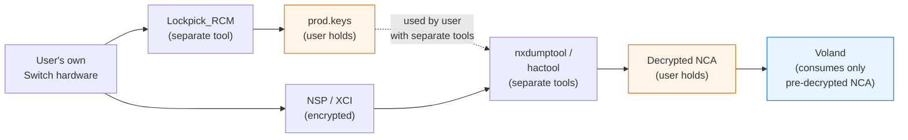

Voland's role is the rightmost box. Everything to the left is the user's responsibility, performed with tools that are not part of Voland.

### What this means for code organization

The loader subsystem (`core/hle/loader/`) accepts already-decrypted NCA files and parses their internal structure (RomFS, ExeFS, npdm). It does **not** contain encryption-handling code. There is no `nca_decrypt.c`, no key-derivation functions, no AES handling for game content, and no NSP/XCI extraction logic that operates on encrypted input.

If a user attempts to load an encrypted NSP or XCI file, Voland reports an error directing them to decrypt using separate tools first.

---

## 2. Repository Structure

```
voland/
  CMakeLists.txt
  global.json
  .gitmodules

  docs/
    DESIGN.md                # this file
    DUMPING.md               # separate-tools guide
    SAVE_FORMAT.md
    TRACE_FORMAT.md
    WASM_BACKEND.md
    GPU_COMMAND_STREAM.md    # versioned CPU→GPU worker command format

  core/                      # C11, platform-agnostic
    cpu/
      cpu.h                  # abstract CPU backend interface (§8)
      cpu.c                  # backend wiring
      dispatch.{h,c}         # JIT block dispatcher loop (§11)
      backends/
        noop/                # default, always builds
        interpreter/         # ARM64 interpreter
        ballistic/           # Ballistic integration (x86 + wasm)
    hle/
      hle.h
      hle.c                  # syscall dispatch table
      kernel/
        memory.{h,c}         # heap/MapMemory SVCs (thin layer over vmm)
        scheduler.{h,c}      # guest thread scheduler (§7)
        thread.{h,c}         # guest thread objects
        sync.{h,c}           # kernel sync objects (events, mutexes, arbiters)
        ipc.{h,c}
      services/
        sm/ fsp/ audio/ hid/ nfc/ network/ nvdrv/ vi/ time/ applet/
        account/ friends/ ssl/
      loader/
        ## PRE-DECRYPTED input only. See §1.6. No NCA decryption code.
        nca_parse.{h,c}  romfs.{h,c}  exefs.{h,c}  npdm.{h,c}
        nso.{h,c}              # NSO executables (LZ4 segments) — needs vendored lz4
        nro.{h,c}              # homebrew format (Phase 2 goal)
    gpu/
      gpu.h  gpu.c
      command_stream.{h,c}   # versioned command records for the GPU ring (§13)
      completion.{h,c}       # GPU→CPU completion ring: syncpoints/fences (§13)
      engines/
        engine_2d.c  engine_3d.c  engine_compute.c
      memory/
        gmmu.{h,c}           # GPU memory management unit
      shader/
        decompiler.{h,c}     # Maxwell SASS/NVN microcode → IR
        backends/
          wgsl.c                 # primary: web drainer + Dawn/wgpu-native (§13)
          spirv.c                # tier-2 native Vulkan only
      texture/
        decode.{h,c}  transcode.c   # ASTC → BC7/ETC2 via compute shader
      video/
        nvdec_bitstream.{h,c}  # slice+param structs → feedable bitstream (all platforms)
        vic.{h,c}              # video image compositor HLE
        backends/              # native only: videotoolbox / mediacodec / ffmpeg
                               # (web: WebCodecs in gpu.worker.ts, no C vtable)
    audio/
      audio.h  audio.c
      dsp/dsp.{h,c}
      backends/  wasapi/ coreaudio/ pipewire/
      ## No webaudio backend directory: on web, the AudioWorkletProcessor
      ## reads the ring directly (§14); the C side only writes the ring.
    common/
      arena.{h,c}            # arena allocator, no malloc in hot paths
      ring_buffer.{h,c}      # SPSC ring buffer (audio ring, GPU command ring)
      log.{h,c}              # structured logging to trace buffer
      assert.h
      vmm.{h,c}              # guest virtual memory manager / softmmu (§5)
      layout.{h,c}           # linear memory layout: region reservation + exports (§4)

  platform/web/
    vite.config.ts  tsconfig.json  index.html  manifest.json
    bindings/
      core.ts                # typed WASM exports
      layout.ts              # linear-memory region offsets (mirrors common/layout.h)
      protocol.ts            # worker message protocol types
    workers/
      cpu.worker.ts          # instantiates core module, runs scheduler loop
      gpu.worker.ts          # loads renderer.wasm (C, webgpu.h via emdawnwebgpu,
                             # §13); TS = loader + present glue + WebCodecs
      compiler.worker.ts     # WebAssembly.compile(); DEDICATED, not shared —
                             # Module structured-clone is restricted to the
                             # same agent cluster, and SharedWorkers get their
                             # own cluster (§11)
    worklets/
      audio-output.worklet.ts  # AudioWorkletProcessor, reads audio ring directly
    shared-workers/
      save-sync.shared-worker.ts       # serialised OPFS save writes
                                       # (async OPFS API only: createSyncAccessHandle
                                       # is unavailable in SharedWorkers)
      compatibility.shared-worker.ts   # game compatibility DB
    sw.ts                    # service worker
    src/
      main.ts  router.ts  store/  components/  styles/
      sync/                  # SaveSyncBackend + google-drive / onedrive /
                             # companion implementations (§15)

  platform/{ios,macos,tvos,visionos}/  # SwiftUI + Metal
  platform/{android,android-tv}/       # Jetpack Compose + Vulkan
  platform/{windows,linux}/            # voland-cli (no Qt; §17) + Qt GUI
                                       # renderer: Dawn/wgpu-native (§13)

  companion/                 # self-hostable Node.js server (§20): signalling,
                             # save-sync backend, TURN pairing. User-hosted only;
                             # Voland operates no instance. User-owned data only.

  recompiler/                # Ballistic git submodule

  tests/
    cpu/ hle/ gpu/ games/
```

Changes from v2: `audio.worker.ts` deleted (§14). `vmm` promoted from "Switch 2, planned" to a Phase 1 subsystem (§5). `layout.{h,c}`, `dispatch.{h,c}`, `scheduler.{h,c}`, `command_stream.{h,c}` added. The Xbox platform directory is removed from the committed tree (§17).

---

## 3. Core Principles

### The core/platform boundary: defer mechanism, never policy

**The guest must never be able to tell which platform it's running on.** Everything that determines guest-observable behavior — timing, memory semantics, scheduling, HLE results, what gets rendered — lives in core. Everything that merely *realizes* an effect the core already decided — present these pixels, decode these bits, emit these samples, persist these bytes — defers to the platform. Core decides; platforms actuate.

Every deferral carries a **conformance contract** that normalizes platform variance at the boundary: the video decoder must land NV12 block-linear in guest memory whatever the platform codec did internally (§13); every audio drainer obeys the same never-wait/silence-on-underrun rules as the worklet (§14). The contract is what makes a deferral guest-invisible.

Known leaks, pre-rejected: **SIMD semantics** — NEON maps to platform SIMD only where bit-exact; denormal/NaN differences leak into game physics as per-platform divergence, so core owns vector semantics and platform SIMD is a proven-exact optimization, never a behavior deferral. **Timing** — platform clocks and callback cadences vary; guest time is virtual (§7), wall-clock coupled only at the pacing layer. **Platform auto-backup** (iCloud/Android app-data backup) — opaque conflict semantics can corrupt saves behind the emulator; the §15 explicit backends are the only sync, and native builds exclude save directories from OS auto-backup.

The rule is falsifiable: per-platform golden-image and interpreter-vs-JIT differential runs (voland-cli, §17) surface any leaked deferral as cross-platform divergence in CI.

Corollary cost, paid knowingly: core targets the **intersection** of platforms — written against the most constrained one (web), native follows for uniformity. See §5 for the largest bill (native fastmem) and its escape hatch.

### Language

- **Core:** C11 strictly. No C++ in core, period. (The dynarmic wrapper exception is gone with dynarmic.)
- **Web platform:** TypeScript strict mode throughout. No `any`. No implicit returns.
- **Native platforms:** Swift (Apple), Kotlin (Android), C++ (Qt desktop, UI layer only).
- **No exceptions in C code.** Explicit error returns everywhere.
- **No dynamic allocation in hot paths.** Arena allocators.

### Naming conventions (DAMP, Descriptive and Meaningful Phrases)

```c
// Good, intent is clear without comments
void hle_dispatch_ipc_request(HLE_Context* context,
                              uint64_t     target_session_handle,
                              IPC_Message* message);

// Bad, abbreviated to the point of obscurity
void hle_dipc(HLE_Ctx* c, uint64_t h, IPC_Msg* m);
```

### No magic numbers

```c
// Bad
if (error_code == 0xF001) { ... }

// Good
#define HLE_ERROR_SERVICE_NOT_FOUND 0xF001
if (error_code == HLE_ERROR_SERVICE_NOT_FOUND) { ... }
```

### Immutability in TypeScript

Never mutate state passed into a function. Always return new state:

```typescript
// Bad
function addGameToLibrary(library: Game[], game: Game): Game[] {
  library.push(game);
  return library;
}

// Good
function addGameToLibrary(library: Game[], game: Game): Game[] {
  return [...library, game];
}
```

### Error handling

```c
// C, explicit result type, no exceptions
typedef enum Result {
  RESULT_OK               = 0,
  RESULT_OUT_OF_MEMORY    = 1,
  RESULT_INVALID_ARGUMENT = 2,
  RESULT_NOT_FOUND        = 3,
  RESULT_IO_ERROR         = 4,
} Result;

typedef struct {
  Result      code;
  const char* message; // static string, never heap allocated
} Error;

#define OK         ((Error){ .code = RESULT_OK, .message = NULL })
#define ERR(c, m)  ((Error){ .code = (c), .message = (m) })
```

```typescript
// TypeScript, Result type, no thrown exceptions in business logic
type Success<T> = { readonly success: true;  readonly value: T };
type Failure    = { readonly success: false; readonly error: string };
type Result<T>  = Success<T> | Failure;
```

---

## 4. Memory Architecture

**There is exactly one memory: the core module's shared, memory64 `WebAssembly.Memory`.** Guest RAM, the register files, the page tables, the framebuffer slots, the audio ring, the GPU command ring, the input region, and the trace buffer are all regions inside it. On native platforms the equivalent is a single large anonymous mapping owned by `core/common/layout.c`.

This is forced, not chosen. Emscripten-compiled C can only dereference addresses inside its own linear memory. A separate `SharedArrayBuffer` handed in from JS is unreachable from the core — there is no operation that turns an external ArrayBuffer into a `void*`. The v2 design allocated guest RAM as a standalone 4GB SAB; that design could never have run.

### Consequences

- **memory64 is mandatory for Switch 1**, not a Switch 2 nicety. Guest RAM (4GB physical, ~3.2GB application-usable) plus Emscripten's own data/stack/heap plus JIT emission buffers, shader IR, and arenas exceeds 4GB of linear memory.
- **memory64 is cross-browser** (shipped as part of WebAssembly 3.0; available in all engines since early 2025), so this is not a portability bet — but it has a real cost: engines lose some 32-bit bounds-check elision, overhead engine-dependent, roughly 5–15% on memory-heavy code. Mitigation: hot host-side structures (register files, JIT state, page tables) live in the low 4GB of the address space where engines retain fast paths. Named escape hatch if measured overhead ever exceeds tolerance: **multi-memory** — keep the core wasm32 (guard-page bounds checks), put guest RAM in a second 4GB wasm32 memory addressed only by JIT-emitted code. It fails today because Clang/Emscripten give C no way to touch a second memory, which would gut the softmmu's one-implementation property; revisit only if toolchain support materializes. Cheap to write down, expensive to rediscover. Listed in the risk register (§28).
- **Browsers cap memory64 at roughly 16GB per memory.** Irrelevant for Switch 1's 5.25GB; a hard constraint for Switch 2 plans (12–16GB guest RAM + host overhead does not fit under a 16GB cap — the sparse-commit VMM has to earn its keep there, not just declare a big address space).
- **Memory size is fixed at boot: `initial === maximum`, growth disabled.** Views over a growable shared memory detach on grow; every worker holds long-lived typed-array views. Fixing the size removes an entire class of view-invalidation bugs. The Switch's memory needs are known at boot; nothing legitimate requires growth.

### Layout

```
WebAssembly.Memory (shared, address: i64, initial == maximum ≈ 5.25 GB)

  0x0000_0000  Emscripten static data, stack, malloc heap
               (hot host structs below 4GB — see memory64 note)
               ├─ per-guest-thread register files
               ├─ page tables (L1 + on-demand L2s, §5)
               ├─ JIT emission buffers
               ├─ framebuffer slots ×2 + publish counter (§6)
               ├─ audio ring (§14)
               ├─ GPU command ring (§13)
               ├─ input region (§18)
               └─ trace buffer (§23)
  GUEST_RAM_BASE                       ┐
               guest physical RAM, 4GB │ arena-carved at boot,
  GUEST_RAM_BASE + 4GB                 ┘ page-aligned
```

### Ownership and exports

`core/common/layout.c` reserves every region in one pass at `emulator_create()` and exports the offsets:

```c
// core/common/layout.h
typedef struct {
  uint64_t guest_ram_base;        // linear-memory offset of guest physical RAM
  uint64_t guest_ram_size;        // 4GB (Switch 1)
  uint64_t page_table_l1_base;    // §5
  uint64_t framebuffer_slot_base; // §6: 2 slots + publish counter
  uint64_t audio_ring_base;       // §14
  uint64_t gpu_ring_base;         // §13
  uint64_t gpu_completion_ring_base; // §13: GPU→CPU syncpoint completions
  uint64_t input_region_base;     // §18
  uint64_t trace_buffer_base;     // §23
  uint64_t breakpoint_region_base;// §23
} Memory_Layout;

const Memory_Layout* layout_get(void);
```

JS-side consumers never allocate shared buffers; they receive the `WebAssembly.Memory` object plus `layout_get()` offsets and construct views:

```typescript
// platform/web/bindings/layout.ts
function guestRamView(memory: WebAssembly.Memory, layout: MemoryLayout): Uint8Array {
  return new Uint8Array(memory.buffer, Number(layout.guestRamBase), Number(layout.guestRamSize));
}
```

Views are constructed once at worker init and are valid forever (no growth).

### What "guest RAM" means here

`GUEST_RAM_BASE + n` is guest *physical* address `n`. Guest code never sees physical addresses — every guest access is a *virtual* address translated by the softmmu (§5). JIT-emitted code therefore never emits `load(guest_address + GUEST_RAM_BASE)` directly; it emits the translation sequence, whose output is a linear-memory offset with the base already folded into the page-table entry.

### Small shared buffers

`frameSync`-style tiny standalone SABs from v2 are gone. Every cross-worker shared region lives in linear memory, because the C core writes to all of them and maintaining duplicate C-side and JS-side write paths for the same data is how the two drift.

---

## 5. Guest Virtual Memory (Softmmu)

The Switch exposes a 36-bit (1.1.0) to 39-bit (2.0.0+) guest virtual address space. Mappings are non-contiguous, permissioned, and remapped at runtime (`MapMemory`, `UnmapMemory`, mirrors, guard pages, stack/heap/alias regions). Native emulators build a host-`mmap` fastmem region with page aliasing; WASM has no aliasing primitive, so Voland uses a **softmmu**: page-table translation on every guest memory access.

This is the single largest performance and correctness decision in the project, which is why it is a numbered top-level section and a Phase 1 deliverable, not a footnote.

### Page tables

Two-level table for a 39-bit VA with 4KB pages (27-bit VPN):

```
L1: 8192 entries (VPN bits 26..14), each an 8-byte linear-memory offset
    of an L2 table, or 0 if absent
L2: 16384 entries (VPN bits 13..0), each an 8-byte PTE
    L2 table = 128KB, allocated on demand from an arena
    one L2 spans 64MB of guest VA

PTE layout (page-aligned host offsets leave the low 12 bits free):
  bits 63..12  linear-memory offset of the backing page
  bit  2       execute permission
  bit  1       write permission
  bit  0       read permission
  PTE == 0     unmapped
```

### Translation fast path

```
vpn      = gva >> 12
l1_index = vpn >> 14
l2_index = vpn & 0x3FFF
l2_base  = load64(PAGE_TABLE_L1_BASE + l1_index * 8)   ; 0 → fault
pte      = load64(l2_base + l2_index * 8)              ; perm bit clear → fault
host     = (pte & ~0xFFF) | (gva & 0xFFF)
```

Two dependent loads plus masking. The JIT emits this sequence (or a call to a per-module local helper function — never a JS import) for every guest load/store; the fault path exits the block with `CPU_EXIT_FAULT` and the faulting GVA, handled by the dispatcher in C. Tier 1 does the full two-load walk every access. A software TLB (small direct-mapped cache of recent translations, checked before the walk) is a measured Phase 5+ optimization, not a Tier 1 requirement.

A second later optimization: because Voland controls physical layout, the main heap can usually be mapped contiguously, letting the JIT skip translation for accesses statically provable to land in it. Noted here so nobody designs it in early — it is an optimization on top of a correct softmmu, not a substitute for one.

The intersection-targeting cost (§3), named: **native builds forgo host-`mmap` fastmem** — the page-aliasing scheme that gives mature native emulators near-free guest access — so that one memory model and one JIT lowering run everywhere. A native fastmem backend for vmm is the escape hatch: guest-invisible by definition if correct (it implements the same mapping), but it bifurcates Ballistic's memory-access lowering into two modes, so it is gated exactly like Tier 2 Vulkan and per-core workers — on profiling showing the softmmu is the native bottleneck, and not before Phase 8.

### One MMU, three consumers

```c
// core/common/vmm.h
typedef struct VMM_Context VMM_Context;

typedef enum {
  VMM_PERM_NONE = 0, VMM_PERM_R = 1, VMM_PERM_W = 2, VMM_PERM_X = 4,
} VMM_Permission;

VMM_Context* vmm_create(void);   // tables carved from layout regions
void         vmm_destroy(VMM_Context* ctx);

// Mapping (called by kernel memory SVCs)
Error vmm_map(VMM_Context* ctx, uint64_t gva, uint64_t guest_pa,
              uint64_t size, uint32_t perms);
Error vmm_unmap(VMM_Context* ctx, uint64_t gva, uint64_t size);
Error vmm_reprotect(VMM_Context* ctx, uint64_t gva, uint64_t size, uint32_t perms);
Error vmm_query(VMM_Context* ctx, uint64_t gva, /* out */ VMM_Region_Info* info);

// Access (interpreter + HLE; JIT emits the equivalent inline)
Error vmm_read8 (VMM_Context* ctx, uint64_t gva, uint8_t*  out);
Error vmm_read16(VMM_Context* ctx, uint64_t gva, uint16_t* out);
Error vmm_read32(VMM_Context* ctx, uint64_t gva, uint32_t* out);
Error vmm_read64(VMM_Context* ctx, uint64_t gva, uint64_t* out);
Error vmm_write8 (VMM_Context* ctx, uint64_t gva, uint8_t  value);
// ... write16/32/64, read/write block variants for HLE buffer copies

// Translation (for HLE code that needs a host pointer to a guest buffer;
// result valid only within the mapped extent it was checked against).
//
// BORROW SEMANTICS: the returned pointer is a handler-scoped borrow — valid
// only until the current HLE handler returns, NEVER stored in service state.
// Green threading guarantees no guest thread (and thus no MapMemory/UnmapMemory)
// runs while a handler executes; a stored pointer outlives that guarantee and
// becomes a remap race — and the Phase 8 per-core-worker experiment voids the
// guarantee entirely. Long-lived references hold GVAs and re-translate at use;
// bulk data uses vmm_read/write_block copies.
// Debug builds enforce this: outstanding borrows are tracked; any
// vmm_map/unmap/reprotect overlapping a live borrow asserts, and handler exit
// asserts no borrows remain. (The GPU command ring is exempt by design: its
// records carry guest PHYSICAL ranges, and stale-physical reads after guest
// remapping are real-hardware DMA semantics that games already fence against.)
Error vmm_guest_to_host(VMM_Context* ctx, uint64_t gva, uint64_t size,
                        uint32_t required_perms, /* out */ void** host_ptr);
```

The interpreter calls `vmm_read*/write*`. HLE services call `vmm_*` directly — **HLE never routes memory access through the CPU backend**; the backend's job is instruction execution, not address translation. The JIT emits the inline fast path against the same tables.

The `Error`-returning functions above are the *checked* calling convention, correct for HLE and lethal for the interpreter — a call, a struct return, and a branch per guest access on the hottest loop in the web build. `vmm.h` therefore also exposes `static inline` walk/read/write helpers operating directly on the tables (fault reported via a `VMM_Fault*` out-param); `vmm.c`'s checked functions are thin wrappers over them. One implementation, two calling conventions. The interpreter uses the inline path, and additionally keeps a 1-entry TLB per access direction (last translated page) in its loop — two fields, and it covers the dominant same-page sequential case. The review rule is unchanged: raw guest-RAM pointer arithmetic outside `vmm.{h,c}` is still rejected; the inline helpers *are* vmm.

All guest addresses crossing any interface in this codebase are **virtual** unless a parameter is explicitly named `guest_pa`.

### Self-modifying code

`vmm_reprotect` and explicit `invalidate_cache` calls (§8) interact: the kernel write-protects pages containing translated code; a write fault on such a page invalidates the affected translations and restores write permission. Standard emulator SMC handling; the mechanism lives in `dispatch.c` (§11).

---

## 6. Threading Model

### Host thread layout

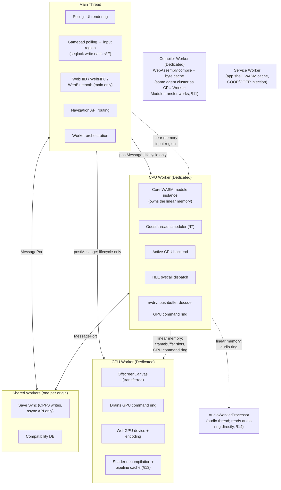

Dashed lines are shared linear memory + Atomics. Solid lines are postMessage, reserved for lifecycle events (init, pause, shutdown, resize, device connect/disconnect) — never per-frame data. There is **no Audio Worker**; the worklet processor reads the ring itself (§14).

### Shared regions (all inside linear memory, §4)

| Region | Producers | Consumers | Sync |
|---|---|---|---|
| Guest RAM | CPU Worker | CPU Worker, GPU Worker (via GPU ring references) | per-structure |
| Framebuffer slots ×2 + publish counter | CPU Worker | GPU Worker | seq counter, Atomics.notify / waitAsync |
| GPU command ring | CPU Worker (nvdrv) | GPU Worker | SPSC ring indices |
| GPU completion ring | GPU Worker | CPU Worker (syncpoint signal) | SPSC ring indices |
| Audio ring | CPU Worker (DSP) | AudioWorkletProcessor | SPSC ring indices, no waiting |
| Input region | Main thread | CPU Worker | seqlock |
| Trace buffer | all workers | UI thread, Chrome extension | atomic write index |
| Breakpoint region | debugger | CPU Worker | atomic flag bits |

### Frame handoff: double-buffered, pipelined

The v2 design serialized CPU and GPU: CPU emulated a frame, waited for the GPU to present it, then started the next — a two-stage pipeline deliberately stalled to one stage. Replaced with a two-slot publish scheme:

```
FRAMEBUFFER_SLOT_BASE:
  +0    publish counter (u32, atomic): count of frames published by CPU
  +4    consume counter (u32, atomic): count of frames consumed by GPU
  +8    slot metadata ×2 (width, height, format, guest source info)
  +N    framebuffer slot 0
  +M    framebuffer slot 1
```

- CPU finishes frame N → writes into slot `N % 2` → atomic-increments publish counter → `Atomics.notify` → **immediately begins frame N+1**.
- CPU blocks only on backpressure: before writing slot `(N+1) % 2`, if `publish - consume >= 2` it waits (blocking `Atomics.wait` **with a 100ms timeout** so pause/shutdown messages are never starved indefinitely).
- GPU waits for `publish > consume` using **`Atomics.waitAsync`** — a worker parked in blocking `Atomics.wait` cannot service `postMessage` (resize, shutdown, WebGPU device-lost). Presents the newest published slot, increments consume, notifies.

If the GPU falls behind, the newest-slot rule means it presents the latest frame and skips stale ones, which is the correct behavior for an emulator (latency beats completeness).

This blit-style handoff is the Phase 3 rendering path. From Phase 4 the GPU command ring (§13) carries real rendering; the framebuffer slots remain for the final present of software-composited surfaces.

---

## 7. Guest Thread Scheduling

The Switch runs games on 3 application cores. Games depend on this: threads spin on flags written by other threads, set core affinities, and assume preemption. A CPU backend that runs until the guest stops would hang on the first cross-thread spinlock. This section defines how Voland multiplexes guest threads; §8 defines the backend interface it drives.

### Model: green threads in one CPU worker

**Decision: all guest threads are green-threaded inside the single CPU Worker for Phases 2–7.** One worker per guest core (true parallelism over shared memory) is a Phase 8+ experiment, gated on profiling showing single-worker throughput is the bottleneck.

Rationale:

- Correctness first. Green threading makes the entire HLE layer single-threaded: no locks in any service, no memory-ordering bugs in kernel objects.
- Exclusive monitors (LDAXR/STLXR) become trivially correct: a per-thread monitor flag cleared on every context switch. Nothing truly runs concurrently, so no host atomics are needed for guest atomics.
  **Starvation guard** — budget expiry landing between LDAXR and STLXR clears the monitor, fails the store, and restarts the sequence; repeated unlucky preemption is a livelock. Three layers: (1) block/region formation **never splits an exclusive pair** — canonical sequences are short and straight-line, and budget checks fire only at block entry, so the JIT cannot preempt inside the window by construction; (2) the interpreter yields only at monitor-clear safe points, with a small instruction cap so a guest that takes a monitor and never stores can't hold the scheduler; (3) scheduler backstop: a per-thread consecutive-STLXR-failure counter grants an uninterrupted grace window after N failures, converting pathological interleavings into bounded delay.
- Per-core workers are an **architecture fork, priced here so the Phase 8 gate is honest.** Invariants that currently hold by single-thread construction and are demolished: JIT emits real `atomic.rmw`/`cmpxchg` for guest exclusives; every kernel object, the handle table, and scheduler queues need locking; §3's arenas are single-threaded; virtual time becomes a contended counter; the GPU command ring's SPSC breaks (multi-producer nvdrv decode); the §5 borrow guarantee is voided; the hid writer's sampling-number protocol goes from decorative to load-bearing; §11's block cache and funcref table are per-worker (wasm tables cannot cross threads → per-worker instantiation of shared modules); and — hardest — **vmm page tables vs concurrent inline JIT walks**: a walker races unmap into torn PTEs, and the two-load fast path cannot afford a lock, so mutation needs a quiesce protocol or RCU-style epochs.
  **The named intermediate, designed before the full fork is ever attempted:** execution workers + one kernel worker. Guest CPU execution parallelizes; SVCs marshal to the kernel worker; **HLE stays single-threaded** (the largest demolition item avoided). Page-table mutation quiesces at the yield points that already exist — budget checks at block entry are safe points: unmap requests all execution workers exit at the next block boundary, applies, resumes. Cost: real atomics, the quiesce protocol, SVC round-trip latency. Evidence gate unchanged: profiling must show single-worker guest-CPU throughput is the bottleneck.

### Bounded execution

The scheduler owns the loop. The backend runs one guest thread for a bounded budget and reports why it stopped:

```c
typedef enum CPU_ExitReason {
  CPU_EXIT_CYCLES_ELAPSED, // budget consumed; thread is preempted
  CPU_EXIT_SVC,            // svc_handler ran; thread may now be blocked
  CPU_EXIT_HALT,           // guest executed a halting condition
  CPU_EXIT_BREAKPOINT,
  CPU_EXIT_FAULT,          // MMU fault or undefined instruction
} CPU_ExitReason;
```

Every backend must be able to stop at translation-block boundaries when the budget expires. For the JIT this is a per-block cycle-counter decrement and check at block entry; this is where Ballistic's planned `OPCODE_YIELD` maps. `run(entry_point)`-until-done does not exist in the interface.

### Scheduler

```c
// core/hle/kernel/scheduler.h
typedef struct Guest_Thread {
  CPU_State*  cpu_state;        // one register file per guest thread
  uint64_t    tls_gva;          // 0x200-byte TLS block; tpidrro_el0 set on switch (§12)
  uint32_t    priority;         // 0 (highest) .. 63, Switch convention
  uint32_t    preferred_core;   // affinity hint; no real parallelism
  Thread_Run_State run_state;   // RUNNABLE, WAITING, SLEEPING, DEAD
  uint64_t    wake_at_ns;       // for SleepThread / timeouts
  Wait_Object* waiting_on;      // kernel sync object, if WAITING
  // intrusive run-queue links, arena-allocated
} Guest_Thread;

void scheduler_tick(Scheduler* sched);  // the CPU worker's main loop body
```

`scheduler_tick`: pick the highest-priority runnable thread (round-robin within a priority band, honoring affinity as a tie-break), call `backend->run(thread->cpu_state, budget)`, then dispatch on the exit reason:

- `CYCLES_ELAPSED` → re-enqueue; advance virtual time.
- `SVC` → the SVC handler already ran inside `run()`. Blocking SVCs (`WaitSynchronization`, `SleepThread`, `ArbitrateLock`) marked the thread WAITING/SLEEPING and registered it on a wait object or timer; the scheduler simply doesn't re-enqueue it. Non-blocking SVCs → re-enqueue.
- `FAULT` → SMC invalidation path (§5) if it's a write to protected code, else guest crash handling.

Threads become RUNNABLE again when another thread signals the wait object or the virtual timer fires.

### Virtual time

A virtual cycle counter advances by the consumed budget on every `run()` return. It backs `CNTVCT_EL0` and the `time:` services. Games that spin waiting on another thread's writes make progress because budget expiry preempts the spinner and virtual time advances past their timeout checks. Wall-clock coupling (so games run at real-time speed) is applied at the frame-pacing level, not inside the scheduler.

### CPU_State is per guest thread

A `CPU_State` is a register file plus a pointer to the shared `VMM_Context` — cheap. The backend's translation cache is shared across all `CPU_State`s of the same process (same address space, same code).

---

## 8. CPU Backend Interface

This interface is the most important abstraction in the project. Every backend implements it exactly. Nothing outside the backend code knows or cares which backend is active.

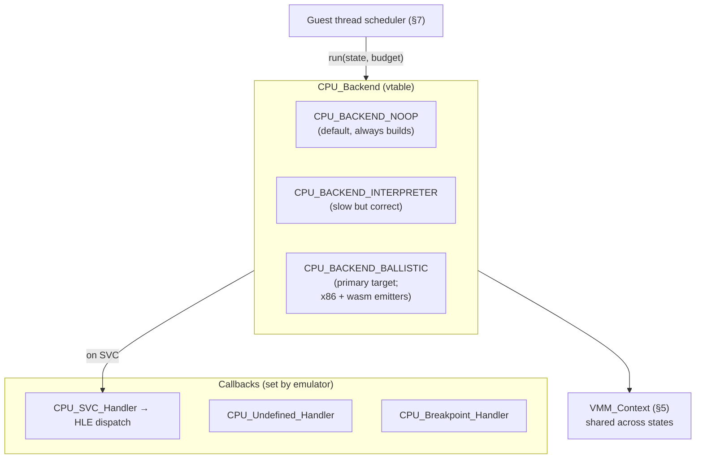

### Header

```c
// core/cpu/cpu.h
#pragma once
#include <stdint.h>
#include <stdbool.h>
#include "common/vmm.h"

typedef struct CPU_State   CPU_State;
typedef struct CPU_Backend CPU_Backend;

// Common architectural state, embedded by every backend. Layout is fixed:
// the JIT's linear-memory register file (Ballistic §10) already pins it.
typedef struct CPU_Register_File {
  uint64_t x[31];   // X0–X30; index 31 does not exist (see get_reg note)
  uint64_t sp;
  uint64_t pc;
  uint32_t pstate;  // NZCV
} CPU_Register_File;

typedef enum CPU_ExitReason {
  CPU_EXIT_CYCLES_ELAPSED,
  CPU_EXIT_SVC,
  CPU_EXIT_HALT,
  CPU_EXIT_BREAKPOINT,
  CPU_EXIT_FAULT,
} CPU_ExitReason;

// Callbacks set by the emulator, called by the backend
typedef void (*CPU_SVC_Handler)(CPU_State* state, uint32_t swi, void* userdata);
typedef void (*CPU_Undefined_Handler)(CPU_State* state, uint32_t instruction, void* userdata);
typedef void (*CPU_Breakpoint_Handler)(CPU_State* state, uint64_t address, void* userdata);

typedef struct CPU_Backend {
  // Lifecycle. One CPU_State per guest thread; vmm is shared.
  CPU_State* (*create)(VMM_Context* vmm, void* userdata);
  void (*destroy)(CPU_State* state);

  // Execution. Runs the thread whose register file is `state` for at most
  // `cycle_budget` cycles. Must be able to stop at translation-block
  // boundaries when the budget expires. Never runs to completion.
  CPU_ExitReason (*run)(CPU_State* state, uint64_t cycle_budget);
  CPU_ExitReason (*step)(CPU_State* state);

  // Exit details, valid after run()/step() returns
  uint64_t (*get_fault_address)(CPU_State* state);   // CPU_EXIT_FAULT
  uint64_t (*get_cycles_consumed)(CPU_State* state); // for virtual time

  // General purpose registers X0–X30 (index 0–30).
  // Index 31 is INVALID at this interface. ARM64 encoding field 31 means
  // XZR or SP depending on instruction context; that disambiguation is
  // internal to each backend's decode. SP has dedicated accessors below.
  // Backends must debug-assert index <= 30.
  uint64_t (*get_reg)(CPU_State* state, uint8_t reg_index);
  void     (*set_reg)(CPU_State* state, uint8_t reg_index, uint64_t value);

  uint64_t (*get_pc)(CPU_State* state);
  void     (*set_pc)(CPU_State* state, uint64_t value);
  uint64_t (*get_sp)(CPU_State* state);
  void     (*set_sp)(CPU_State* state, uint64_t value);
  uint32_t (*get_pstate)(CPU_State* state);   // NZCV
  void     (*set_pstate)(CPU_State* state, uint32_t value);

  // Fast path for HLE. Every SVC reads/writes 6–10 registers; paying an
  // indirect call per register on the hottest HLE path is waste. Backends
  // embed this struct as their architectural state and return a pointer
  // that is stable for the state's lifetime. HLE reads regs->x[8] directly.
  // The accessors above remain for the debugger and tests.
  CPU_Register_File* (*get_register_file)(CPU_State* state);

  uint64_t (*get_sys_reg)(CPU_State* state, uint32_t encoded_reg);
  void     (*set_sys_reg)(CPU_State* state, uint32_t encoded_reg, uint64_t value);

  // Code cache management. Called by the SMC path (§5) and module loaders.
  // Shared across all CPU_States of the same process.
  void (*invalidate_cache)(CPU_State* state, uint64_t guest_va, uint64_t size_bytes);
  void (*clear_cache)(CPU_State* state);

  void (*set_svc_handler)(CPU_State* state, CPU_SVC_Handler handler);
  void (*set_undefined_handler)(CPU_State* state, CPU_Undefined_Handler handler);
  void (*set_breakpoint_handler)(CPU_State* state, CPU_Breakpoint_Handler handler);

  const char* name;          // "noop", "interpreter", "ballistic"
  const char* version;
  bool        supports_jit;
} CPU_Backend;

extern const CPU_Backend CPU_BACKEND_NOOP;
extern const CPU_Backend CPU_BACKEND_INTERPRETER;
extern const CPU_Backend CPU_BACKEND_BALLISTIC; // only if -DCPU_BACKEND=ballistic

const CPU_Backend* cpu_get_active_backend(void);
```

Changes from v2: `create` takes `VMM_Context*` instead of `(guest_ram, ram_size)` — backends never see raw guest RAM, they see the MMU. `run` is bounded and returns an exit reason. `run_until` deleted (the debugger uses breakpoints + `step`). `halt`/`is_halted` deleted (halting is an exit reason; run state lives in the scheduler). Register index 31 is documented invalid. `supports_wasm` deleted (an emitter detail, not an interface property).

### Register index reference

```c
// X0-X7: args/returns   X29: FP   X30: LR
// (X8 is NOT the syscall number on Horizon — the SVC immediate is. §12.)
#define CPU_REG_X0   0
#define CPU_REG_X29  29
#define CPU_REG_X30  30
// There is no CPU_REG_XZR / CPU_REG_SP constant at this interface.
// SP: get_sp/set_sp. XZR: not architectural state; nothing to access.
```

---

## 9. No-Op Backend

The no-op backend is the default. It builds on all platforms with zero dependencies. It maintains register state so HLE services can read and write registers, and it honors the exit-reason contract so the scheduler can be developed against it. It does not execute any ARM instructions.

**Every subsystem except actual game execution can be built and tested with the no-op backend** — the frontend, storage, worker architecture, Service Worker, scheduler, and HLE scaffolding. This decouples Voland's development from Ballistic's development entirely.

```c
// core/cpu/backends/noop/noop.c (abridged; accessor boilerplate as in v2)

typedef struct {
  uint64_t general_regs[31];
  uint64_t pc, sp;
  uint32_t pstate;
  uint64_t fault_address;
  uint64_t cycles_consumed;
  VMM_Context* vmm;
  void* userdata;
  CPU_SVC_Handler svc_handler;
  CPU_Undefined_Handler undefined_handler;
  CPU_Breakpoint_Handler breakpoint_handler;
} NoopState;

static CPU_ExitReason noop_run(CPU_State* state, uint64_t cycle_budget) {
  NoopState* s = (NoopState*)state;
  // Pretend the budget was consumed so virtual time advances and the
  // scheduler loop is exercised end-to-end.
  s->cycles_consumed = cycle_budget;
  return CPU_EXIT_CYCLES_ELAPSED;
}

static uint64_t noop_get_reg(CPU_State* state, uint8_t index) {
  assert(index <= 30);
  return ((NoopState*)state)->general_regs[index];
}
// ... remaining accessors identical in shape to v2, minus halt/run_until
```

Tests can drive HLE by setting registers and invoking the SVC handler directly — the same path a real backend takes on an SVC exit.

---

## 10. Ballistic Integration Plan

### What Ballistic is

Ballistic ([github.com/pound-emu/ballistic](https://github.com/pound-emu/ballistic)) is a C rewrite of the dynarmic ARM recompiler — a **separate upstream project**, consumed as a submodule, never modified in-tree. Working barebones x86 backend exists in `src/backend/x86/`. **The WASM backend is paused upstream: the maintainer has asked downstream consumers to hold off while the IR API stabilizes.** Voland writes no code against Ballistic's IR — no vendored headers, no homegrown WASM emitter, no fork — until upstream declares it stable. The x86 backend is not paused and remains the desktop JIT path.

### Backend matrix

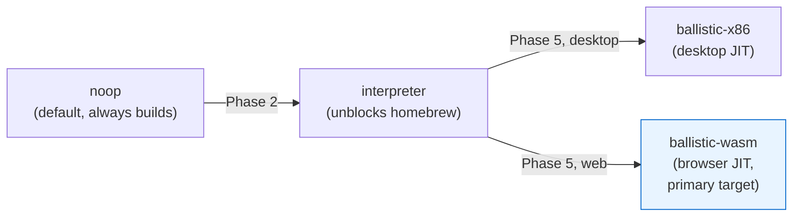

Backend selection inside Ballistic is compile-time (`-DBALLISTIC_BACKEND=wasm|x86`), per its D-cache rules — no function-pointer dispatch in the translation loop.

### Contract items Voland requires from Ballistic

These are integration requirements this design imposes on the Ballistic WASM backend. With the WASM backend paused upstream, they are filed now as **design input** (Pound Discord) — constraints from a downstream consumer, stated while the IR is still malleable and changes are cheap. They become a hard gate only when upstream resumes WASM work; Voland builds nothing against them before then. Several diverge from Ballistic's current draft doc:

1. **Bounded execution / yield points.** Emitted code decrements a cycle counter per block and exits when it reaches zero (`OPCODE_YIELD` semantics). Required by §7.
2. **MMU-aware loads/stores.** Emitted guest memory accesses perform the §5 page-table walk (inline or via a same-module helper). `iN.load offset=0` against raw guest addresses is not a valid emission.
3. **Host-provided layout constants.** Register-file base, page-table L1 base, and guest-RAM base are configuration passed at compiler init — not constants Ballistic picks. Collision avoidance is the host's job via §4 layout.
4. **Exit-code ABI, no traps for control flow.** Block functions return the next guest PC (i64), with exit reason in a fixed linear-memory mailbox slot. `OPCODE_TRAP` writes its reason to the mailbox and *returns*; it does not emit `unreachable` (a WASM trap unwinds through the JS boundary as a RuntimeError — orders of magnitude more expensive than a return, for no benefit).
5. **No function imports; two non-function imports.** Region modules import (a) the shared memory and (b) the core module's growable `funcref` table. Register file and mailbox live in linear memory; SVC/fault/budget exits go through the return path. The table import is what makes the C dispatcher's `call_indirect` reach region block functions without a JS bounce per inter-region jump (§11). This changes Ballistic's module envelope: table import section, typed `() → i64` entries. (Resolves the v2 contradiction where §4 instantiated modules with `env.read_reg/write_reg/call_hle` imports while §7b claimed no imports — function imports stay banned.)
6. **Region-granularity modules**, not per-block modules. See §11.
7. **Shared, memory64 memory type.** Emitted modules import a shared memory with the memory64 flag and matching limits, or instantiation throws.

### Executable memory abstraction per platform

```c
// Native (Linux/macOS/Android): mmap RW → mprotect RX (W^X)
// Windows: VirtualAlloc / VirtualProtect
// WASM: no executable memory; "commit" ships bytes to the host,
//       which compiles them:
void wasm_commit_executable(void* ctx, void* mem, size_t size) {
  wasm_schedule_compile(ctx, mem, size); // → Compiler Worker (dedicated)
}
```

### NEON ↔ WASM SIMD

ARM NEON v8–v31 (128-bit) maps to WASM v128 (`vadd.i32→i32x4.add`, `vld1.32→v128.load`, etc). `-msimd128` is a required build flag (§24); without it vertex-heavy code drops ~4x. Out of Ballistic Tier 1 scope; noted for the build system and the eventual FP/SIMD tier.

---

## 11. JIT Compilation Pipeline

### Compilation unit: regions, not blocks

One `WebAssembly.Module` per basic block does not scale: thousands of instantiations, per-module baseline-compile overhead, and — worst — no block chaining, so every block exit crosses back into the dispatcher. Voland compiles **regions**:

- Start at a requested entry GVA. Follow direct branches, including both arms of conditionals, adding blocks to the region.
- Stop growing at: indirect branch, `RET`, SVC, back-edge to an address outside the region, or a size cap (~64KB of emitted WASM).
- Emit the region as **one module**: each block is a function, all registered in a module-local `funcref` table. Direct intra-region jumps are direct calls or structured branches; intra-region indirect targets go through `call_indirect` on the local table.
- A block exit that leaves the region returns `(next_guest_pc, exit_reason)` to the dispatcher.

### The dispatcher

`core/cpu/dispatch.c` — C code inside the core module, the hot loop of `run()`:

```
loop (until budget exhausted or non-resume exit):
  entry = block_cache_lookup(pc)          // GVA → table index
  if miss:
      interpret until region boundary     // immediate progress
      request async region compile (once per region)
      continue
  pc, exit_reason = call_indirect(entry)  // execute compiled region
  switch exit_reason:
      RESUME:        continue             // inter-region jump
      SVC:           invoke svc_handler; return CPU_EXIT_SVC to scheduler
      BUDGET:        return CPU_EXIT_CYCLES_ELAPSED
      FAULT:         return CPU_EXIT_FAULT
```

How the C dispatcher reaches region code: the **core module exports one growable `funcref` table; region modules import it**. At instantiation (cold path) the host `table.grow`s if needed and `table.set`s each block function into allocated slots; the block cache stores table indices; `call_indirect` on that table is a genuine in-wasm call — zero JS on the dispatch hot path. Wasm tables cannot be shared across threads, but this table never needs to be: the core instance and every region instance live in the same CPU Worker — under the current single-worker design, and per-core workers (§7) would force per-worker tables and per-worker instantiation; that cost is on §7's fork price list. Instantiation itself uses the synchronous `new WebAssembly.Instance(module)` — legal and fast in a worker for an already-compiled module; do not add an async hop on the instantiate side.

**Block-cache single-writer invariant, stated because it is enforced by construction rather than by code:** every mutation — instantiation on compile-message receipt, `table.set`, cache registration, SMC invalidation from SVC handlers — executes on the CPU worker thread, and cannot interleave mid-`run()` because synchronous WASM blocks the worker's event loop; messages queue until the scheduler tick returns. No locks exist because none are needed *on this design*; any change that introduces a second mutator (per-core workers, moving instantiation elsewhere) inherits the §7 fork price.

The interpreter is the mandatory fallback while compiles are in flight (`WebAssembly.compile` is async); for hot code the gap closes after one compilation.

### End-to-end flow (web)

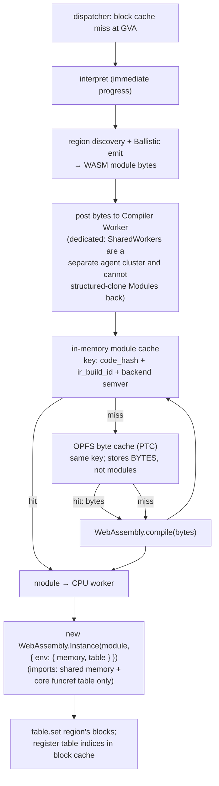

### Cache keying

**Key = `hash(region code bytes) + ir_build_id + backend_version`, namespaced by titleId.** Not guest address: ASLR and title updates make GVAs unstable and collision-prone. The GVA lives in the in-memory block-cache *entry*, never in the persistent key. `ir_build_id` covers Ballistic's IR compaction pass, which can change SSA assignments for identical input bytes.

### Persistence reality

A compiled `WebAssembly.Module` **cannot** be persisted — only its bytes. Chrome removed IndexedDB module caching years ago. Consequence, stated plainly: **the PTC eliminates translation cost (ARM→WASM emission), not compile cost (`WebAssembly.compile`).** Every session pays baseline compilation of cached bytes. Baseline compile throughput is tens of MB/s of wasm, so this is acceptable — and it is why AOT pre-translation (Phase 7) is more valuable than it would be natively: it front-loads translation, and warm sessions reduce to a bulk compile at launch.

The same agent-cluster rule that forces the compiler to be a dedicated worker also means compiled Modules can never be shared across tabs — cross-tab sharing exists only at the byte level, which the OPFS PTC already is. There is nothing a SharedWorker could have added here.

### Self-modifying code

`invalidate_cache(gva, size)` drops block-cache entries whose regions overlap the range and marks their region modules dead (instances dropped; GC reclaims). Combined with the §5 write-protection fault path.

---

## 12. HLE Service Layer

HLE intercepts Switch OS syscalls and implements them directly in the host rather than running Switch OS code. This is how all Switch emulators operate.

### Syscall dispatch flow

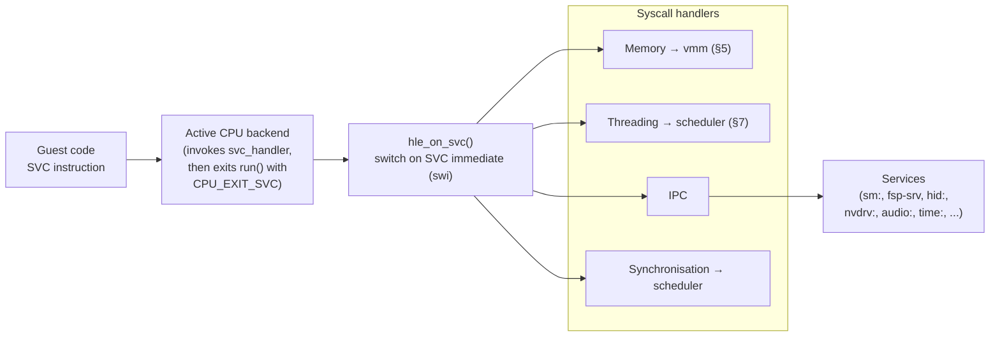

Two structural rules introduced by §5 and §7:

1. **HLE memory access goes through `vmm_*`, never the CPU backend.** Reading a guest IPC buffer is `vmm_read_block` / `vmm_guest_to_host`, not backend memory poking. All guest pointers arriving in SVC arguments are virtual addresses.
2. **Blocking SVCs don't block.** `WaitSynchronization`, `SleepThread`, `ArbitrateLock` mark the current guest thread WAITING/SLEEPING on a kernel object or timer and return; the scheduler (§7) doesn't re-enqueue the thread. There is no busy-wait or host-thread block anywhere in HLE. The entire HLE layer is single-threaded and lock-free by construction under the green-threading model.

### The call surface: SVC → HIPC → CMIF

An IPC "call" a game makes to a service crosses three layers, and all three are Voland's to implement. This is the highest-volume code in the project; it needs a fixed shape, not per-service improvisation.

**Thread-local storage is the transport.** Every guest thread owns a 0x200-byte TLS block; its first 0x100 bytes are the IPC command buffer. `tpidrro_el0` points at the block. Consequences: the kernel thread code allocates TLS blocks from a TLS page allocator (guest-visible pages, mapped via vmm); `Guest_Thread` carries `tls_gva`; the scheduler sets `tpidrro_el0` on every context switch through the backend's sys-reg interface, and JIT-emitted `mrs tpidrro_el0` reads it from the per-thread state. IPC cannot be stubbed without TLS existing — it is a Phase 1 dependency, not a detail.

**HIPC (kernel transport).** `SendSyncRequest` parses the command buffer from the caller's TLS via vmm: header words, handle descriptor (send-PID flag, copy handles, move handles), buffer descriptors (X = pointer, A = send, B = receive, C = receive-list), then the aligned data payload. Buffer descriptors carry guest VAs + sizes; handlers access them **only** through `vmm_guest_to_host(gva, size, perms)` — a descriptor is untrusted input, never a raw pointer.

**CMIF (service protocol).** Inside the HIPC payload: `SFCI` magic + command ID inbound, `SFCO` + Result outbound. Sessions can be converted to **domains** — multiple service objects multiplexed over one session, requests addressed by object ID. Games use domains heavily; a session/domain split that arrives "later" arrives as a rewrite. Domain state (object table) lives on the session from day one, even while most services are stubs.

**The C service-object pattern.** The C# references use classes; Voland's shape is one struct + a sorted command table per interface:

```c
typedef struct IPC_Request  IPC_Request;   // parsed HIPC+CMIF views (buffers via vmm)
typedef struct IPC_Response IPC_Response;  // writer for SFCO + out handles/objects

typedef HLE_ServiceResult (*Service_Command_Fn)(
    Service_Object* self, IPC_Request* req, IPC_Response* res);

typedef struct Service_Command {
  uint32_t           command_id;
  Service_Command_Fn handler;
  const char*        name;      // for trace/coverage output
} Service_Command;

typedef struct Service_Interface {
  const char*            name;            // "IApplicationDisplayService"
  const Service_Command* commands;        // sorted by command_id, bsearch
  size_t                 command_count;
} Service_Interface;
```

Dozens of services × dozens of commands makes this the prime candidate for the `/new-hle-service` scaffolding command once the pattern is proven on `sm:`.

**Handle table.** Per-process, fixed-size (Horizon caps at 1024), each entry carrying a generation counter so stale handles fault instead of aliasing. Pseudo-handles `0xFFFF8000` (current thread) and `0xFFFF8001` (current process) are resolved before table lookup. All kernel objects (threads, events, sessions, shared memory, transfer memory) live behind it.

### Process bootstrap — what "load a game" actually does

1. Parse decrypted NCA → ExeFS. ExeFS contains **NSO** executables (`rtld`, `main`, `subsdk*`, `sdk`): per-segment **LZ4-compressed** .text/.rodata/.data plus bss. The loader tree gains `nso.{h,c}` and `nro.{h,c}` (NRO is the homebrew format — required for the Phase 2 goal, not optional). LZ4 (single-file, BSD) joins the core dependency list; it is the only third-party code in `core/`.
2. `npdm` supplies address-space type, main-thread priority/core/stack size, and the kernel capability list.
3. Map NSOs at an ASLR'd base inside the 39-bit space; carve heap/alias/stack regions per the Horizon layout; vmm answers the `GetInfo` region queries from this same layout — one source of truth.
4. Allocate the main thread: TLS block, stack, and the Horizon entry ABI — **X0 = 0, X1 = main thread handle**, PC = rtld entry. From here the scheduler runs it like any other guest thread.

### hid: is a shared-memory service

`hid:` IPC commands mostly activate npads and hand out a **shared-memory handle** (~0x40000 bytes). Games never poll input over IPC; they read per-npad state rings (17-entry, sampling-number-stamped) directly from that memory. The emulator's real obligation is therefore a **HID shared-memory writer**: a scheduler-tick-cadence task that transforms the §18 input region into the guest-visible HID layout — button/stick state, connection/style bits, incrementing sampling numbers. §18's seqlock region is the *host-side* transport; this writer is the *guest-side* contract. Implement the sampling-number ordering protocol for real from day one, even though green threading makes torn guest reads impossible today — under §7's per-core fork it becomes load-bearing, and retrofitting ordering into a writer games already depend on is the worst time to do it. The same shape recurs later for `time:` (clock-context shared memory).

The writer must present **N independent npads with per-controller style bits**, not just player 1 — this is the entire mechanism for same-console multiplayer (§20, surface 2). A writer that only populates the first npad silently breaks every couch co-op title. The §18 input region is already sized for 8 controllers; the obligation is that the HID layout reflects each connected controller's style (handheld / dual / single-L / single-R) and connection state independently.

### Firmware-free policy

Voland neither requires nor accepts Nintendo firmware. Services that conventionally lean on firmware data get synthesized replacements: `pl:u` shared fonts from open-licensed fonts repackaged into the shared-font format at build time; `time:` timezone rules converted from IANA tzdb at build time; Mii database **synthesized**: procedurally generated defaults, zero Nintendo data — an empty DB makes Mii-consuming titles (Mario Kart class) misbehave, so "stub empty" (v3.2) is revised here. This is a §1.6-adjacent scope rule: contributors proposing "let the user supply firmware dumps" are redirected here — it reintroduces the distribution-and-decryption questions §1.6 exists to avoid, for data we can synthesize.

### Unimplemented-surface policy

Uniform across the project, decided once:

- **Unknown SVC:** log + `HLE_RESULT_NOT_IMPLEMENTED` in W0 (as in the dispatch table's default arm).
- **Unknown service command:** log service name + command ID, emit a `TRACE_UNIMPL_CMD` trace event, return a not-implemented Result in the CMIF response. **Never silently return success by default.**
- **Explicit stub allowlist:** where returning success is known to unblock boot (common for fire-and-forget applet/account calls), the stub is a named entry in the service's command table with a `_stub` handler — grep-able, reviewed, never implicit.
- First-hit unknown commands feed the trace buffer and, from Phase 5, the compatibility DB — "hangs at scene X" reports come with the exact missing surface attached.

### Stub upgrade map

Where the traditional desktop-emulator stub is not the ceiling. Three tiers, so the intent survives contributor turnover:

**Web-native implementations** (the browser gives these a real backing that desktop emulators lack): the **controller applet** ("Change Grip/Order" — games block on it before couch-multiplayer sessions; an HTML overlay assigning Gamepad-API pads to npad slots); `swkbd` and inline keyboard via an HTML overlay (real IME, mobile keyboards — games block on this for save names); the offline web applet by rendering RomFS HTML in a locked-down sandboxed iframe (Voland *is* a browser); `set:sys` language/region from `navigator.language` with a settings override; `caps` screenshots to an OPFS album (the §22 gallery already assumes it); `grc` 30-second video capture via `VideoEncoder` in the GPU Worker → WebM in OPFS; `psm` battery from the Battery Status API where present.

**Correctness-bearing, implement properly everywhere:** `apm` docked/handheld (games pick render targets from it — a hardcoded answer locks every title to one profile); `nifm` connectivity reported honestly (connected iff an LDN session is active or a §20 server entry is active for the running title); `mii` synthesized default database (see firmware-free policy); `account` local profiles in IndexedDB.

**Deliberately stubbed, with reasons:** `prepo` (telemetry to Nintendo — stub success forever); `bcat` (bcat payloads are Nintendo content — a server changes the operator, not the data; §1.6's data rule bans it user-hosted or not; local import of the user's own console-dumped data is the ceiling); `olsc` (the IPC service stays stubbed forever — the *feature*, cross-device save sync, is emulator infrastructure via §15's backends: the user's own Google Drive/OneDrive, or the §20 companion server); `npns` (nothing to push; the companion server's presence channel is where an npns-lite would land if a friends layer ever exists). Proposals to "fix" these get redirected here.

### Dispatch table

```c
// core/hle/hle.c
void hle_on_svc(CPU_State* cpu_state, uint32_t swi, void* userdata) {
  HLE_Context* context = (HLE_Context*)userdata;

  // Horizon ABI: the syscall ID is the SVC instruction's IMMEDIATE — the
  // `swi` value the backend already passed in. It is NOT in X8; that is the
  // Linux ARM64 convention and does not apply here. (v2/v3.1 of this doc
  // dispatched on X8. That was a bug; it would fail on the first SVC.)
  //
  // Per-SVC register ABI (switchbrew is authoritative per SVC): arguments
  // arrive in W0–W7 / X0–X7, the Result code returns in W0, additional
  // outputs in W1/X1 onward. Handlers read/write these directly through
  // the register file struct (§8), not through per-register accessors.
  CPU_Register_File* regs = context->cpu_backend->get_register_file(cpu_state);

  switch (swi) {
    // Memory
    case 0x01: hle_svc_set_heap_size(context, cpu_state);          break;
    case 0x02: hle_svc_set_memory_permission(context, cpu_state);  break;
    case 0x03: hle_svc_set_memory_attribute(context, cpu_state);   break;
    case 0x04: hle_svc_map_memory(context, cpu_state);             break;
    case 0x05: hle_svc_unmap_memory(context, cpu_state);           break;
    case 0x06: hle_svc_query_memory(context, cpu_state);           break;
    // Threading
    case 0x08: hle_svc_create_thread(context, cpu_state);          break;
    case 0x09: hle_svc_start_thread(context, cpu_state);           break;
    case 0x0A: hle_svc_exit_thread(context, cpu_state);            break;
    case 0x0B: hle_svc_sleep_thread(context, cpu_state);           break;
    case 0x0C: hle_svc_get_thread_priority(context, cpu_state);    break;
    // Synchronisation
    case 0x18: hle_svc_wait_synchronization(context, cpu_state);   break;
    case 0x19: hle_svc_cancel_synchronization(context, cpu_state); break;
    case 0x1A: hle_svc_arbitrate_lock(context, cpu_state);         break;
    case 0x1B: hle_svc_arbitrate_unlock(context, cpu_state);       break;
    case 0x1C: hle_svc_wait_process_wide_key_atomic(context, cpu_state); break; // condvar wait
    case 0x1D: hle_svc_signal_process_wide_key(context, cpu_state);      break; // condvar signal
    // Events / shared memory (games touch these before first frame)
    case 0x11: hle_svc_signal_event(context, cpu_state);           break;
    case 0x12: hle_svc_clear_event(context, cpu_state);            break;
    case 0x13: hle_svc_map_shared_memory(context, cpu_state);      break;
    case 0x14: hle_svc_unmap_shared_memory(context, cpu_state);    break;
    case 0x15: hle_svc_create_transfer_memory(context, cpu_state); break;
    // IPC
    case 0x1F: hle_svc_connect_to_named_port(context, cpu_state);  break;
    case 0x21: hle_svc_send_sync_request(context, cpu_state);      break;
    // Handles / Info
    case 0x26: hle_svc_close_handle(context, cpu_state);           break;
    case 0x29: hle_svc_get_info(context, cpu_state);               break;

    default:
      log_warn("[HLE] Unimplemented SVC 0x%02X at PC 0x%016llX", swi, regs->pc);
      trace_emit(TRACE_UNIMPL_SVC, /*thread*/ 0, swi, 0); // feeds coverage (§12 policy)
      regs->x[0] = HLE_RESULT_NOT_IMPLEMENTED;
      break;
  }
}
```

The table above is the boot-critical core, not an enumeration. Two entries are easy to underestimate: **0x1C/0x1D are the condition-variable SVCs** — every nnsdk mutex and condvar is built on them plus the address arbiters (0x1A/0x1B), so no threaded game code runs without them — and `GetInfo` (0x29) is fired dozens of times at boot to discover the address-space layout (alias/heap/ASLR/stack region base+size, total/used memory, among others); the memory HLE must answer the full region-query set from vmm's layout, not stub it.

### HLE result type

```c
#define HLE_RESULT_SUCCESS          0x00000000
#define HLE_RESULT_NOT_IMPLEMENTED  0xF601
#define HLE_RESULT_INVALID_HANDLE   0xE401
#define HLE_RESULT_INVALID_POINTER  0xCC01
#define HLE_RESULT_OUT_OF_MEMORY    0x1A01
#define HLE_RESULT_NOT_FOUND        0xE002
#define HLE_RESULT_ALREADY_EXISTS   0xFA02

// Horizon Result encoding: (description << 9) | module. Module 1 is the
// kernel — the constants above are genuine kernel results, e.g.
// 0xE401 = (114 << 9) | 1. Service-specific results use their own module.
#define HLE_MAKE_RESULT(module, description) \
  ((uint32_t)(((description) << 9) | ((module) & 0x1FF)))
```

### Services implementation priority

Games will not boot past the first frame without these, in order:

1. **`sm:`** — all other services connect through this
2. **Memory SVCs** — SetHeapSize, QueryMemory, MapMemory, UnmapMemory (thin layer over vmm)
3. **IPC** — ConnectToNamedPort, SendSyncRequest
4. **Threading + sync** — CreateThread, StartThread, SleepThread, WaitSynchronization (thin layer over scheduler)
5. **`fsp-srv`** — filesystem, RomFS, save data (pre-decrypted NCA per §1.6)
6. **`nvdrv:`** — ioctl surface (/dev/nvmap, /dev/nvhost-as-gpu, /dev/nvhost-gpu, /dev/nvhost-ctrl, /dev/nvhost-nvdec, /dev/nvhost-vic), GPFIFO submission → GPU command ring, syncpoints, video decode (§13)
7. **`vi:` + buffer queue (nvnflinger)** — the present path. Games render via nvdrv but *present* via the vi display service and `IHOSBinderDriver`: an Android-style BufferQueue spoken in parcels (dequeue/queue buffer, vsync event). Without this there are no pixels — it is a Phase 3/4 deliverable, omitted entirely from earlier revisions of this doc (§13)
8. **`appletOE` / `appletAE`** — lifecycle
9. **`hid:`** — shared-memory writer + npad activation (see "hid: is a shared-memory service" above)
10. **`audio:`** — IAudioDevice, IAudioRenderer
11. **`time:`** — IStaticService (backed by virtual time, §7)

### Loader subsystem note

Per §1.6, `core/hle/loader/` operates on pre-decrypted NCA only. On encrypted input it returns an error directing the user to `docs/DUMPING.md`.

---

## 13. GPU Architecture

### CPU↔GPU split and the command ring

nvdrv pushbuffer decoding happens in the CPU Worker (it is HLE); the WebGPU device lives in the GPU Worker. Between them sits the **GPU command ring**: an SPSC ring in linear memory carrying decoded, versioned command records defined in `core/gpu/command_stream.h` and documented in `docs/GPU_COMMAND_STREAM.md`.

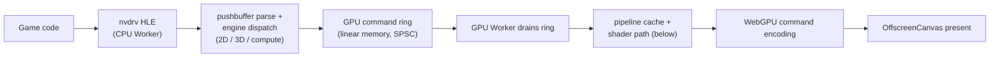

Command records reference guest memory (vertex/index/uniform data, textures) by guest physical ranges resolved by the CPU-side decoder; the GPU Worker reads them through its guest-RAM view. Record format is versioned so the two workers can never silently disagree.

**The reverse path: completions and syncpoints.** The command ring is CPU→GPU; fences need GPU→CPU. Games synchronise on **syncpoints** — u32 counters incremented on GPU work completion, waited on through nvhost-ctrl events. A small **GPU completion ring** (same SPSC discipline, opposite direction, in the §4 layout) carries `(syncpoint_id, value)` records from the GPU Worker back; the CPU Worker drains it at scheduler-tick cadence and signals the corresponding kernel wait objects. The vsync event games wait on is the same mechanism driven by the frame pacer.

**The present path is vi:, not raw framebuffers.** `vi:` + the buffer-queue service (`IHOSBinderDriver`, Android BufferQueue semantics over parcels) is how a game's completed frame reaches the display: the game dequeues a buffer, renders into it via nvdrv, queues it back. Voland's buffer-queue implementation feeds queued buffers into the §6 framebuffer-slot handoff (or, past Phase 4, directly into the GPU Worker's composition). The §6 slots are the *transport*; vi/BufferQueue is the *contract* games program against.

### Video decode: NVDEC/VIC

The Switch's NVDEC (`/dev/nvhost-nvdec`) decodes H.264/VP8/VP9 cutscene bitstreams; VIC (`/dev/nvhost-vic`) converts/scales the output. **Games wait on syncpoints for decode completion — a stub that signals its syncpoints (black output) is mandatory from Phase 4 or cutscene-bearing titles deadlock.** Real decode rides existing infrastructure:

1. **Bitstream reconstruction (platform-independent C, `core/gpu/video/nvdec_bitstream.{h,c}`).** NVDEC submissions are raw slices + decomposed picture-parameter structs, not a container stream. Synthesize SPS/PPS NALs (H.264 AnnexB) / rebuild the VP9 uncompressed frame header from the parameter structs. yuzu's codec code is the behavioral reference.
2. **Transport reuse.** Decode requests are GPU-command-ring records (bitstream guest range, output surface, syncpoint ID); completions return on the GPU completion ring like any fence.
3. **Web backend = WebCodecs `VideoDecoder` in the GPU Worker** — hardware decode, cross-browser (Chromium 94+, Safari 16.4+, Firefox 130+), worker-available. Per output `VideoFrame`: `copyTo` (NV12) → swizzle to **block-linear** (NVDEC's output layout, which the guest GPU consumes) → write into the guest surface via the guest-RAM view → post `(syncpoint_id, value)` on the completion ring → `frame.close()`. Decode latency hides behind the games' own frame buffering.
4. **VIC HLE** implements the post-decode convert/scale ops (compute shader or CPU on the decoded surface).
5. **Zero-copy is a later optimization:** `importExternalTexture` for the decode→VIC→present fast path, skipping readback+swizzle — layered on top of the write-back path, never replacing it, because games sample decoded surfaces as ordinary textures.

Native backends mirror the audio-drainer pattern: shared C reconstruction, then VideoToolbox / MediaCodec / FFmpeg behind a small vtable; on web the C vtable is never instantiated (the GPU Worker's TS side is the backend, as with rendering).

**Fallback policy:** unsupported codec → the syncpoint-signalling black-frame stub plus a per-title compatibility note. No FFmpeg-WASM software decoder — a multi-MB core dependency for a near-empty case (H.264/VP9/VP8 hardware decode is universal on Voland's targets).

**Shader decompilation runs in the GPU Worker.** It owns the device and the pipeline cache; the CPU worker ships microcode by content hash (deduplicated — a hash it has already shipped is not re-sent).

The Phase 3 framebuffer-blit path (§6) bypasses the ring; it dies in Phase 4 when the ring carries real rendering.

### Shader pipeline: async compile, honestly

The v2 design specified an "uber-shader" fallback that renders any shader state with zero compile latency. **That strategy is not available for this hardware and has been removed.** Uber-shaders work where the pipeline state space is enumerable (Dolphin's GC/Wii fixed-function-era pipelines). Switch games ship arbitrary compiled Maxwell shader programs; a variant "matching state S" would have to be a GPU-side interpreter for Maxwell ISA — a research project neither yuzu nor Ryujinx attempted, for this reason.

The real pipeline:

1. **First encounter** of a shader program: kick async decompilation (Maxwell SASS/NVN microcode → IR → WGSL/GLSL/MSL/HLSL) + pipeline creation.
2. While compiling, per user setting:
   - **Stall** (default): the frame waits for the pipeline. Accurate, stutters on first encounters.
   - **Skip**: the draw is dropped for this frame. Fast, visible pop-in/flicker.
3. **Persistent pipeline cache** in OPFS keyed by `hash(shader microcode) + decompiler_version + backend`. First-encounter stutter is first-*session*-per-title, not first-frame-per-play.
4. **AOT pre-translation** (Phase 7, opt-in per game) walks known shaders up front.

Terminology fix carried through the codebase: games contain **Maxwell SASS / NVN-compiled microcode**, not PTX. `core/gpu/shader/decompiler.{h,c}` inputs are named accordingly.

### ASTC texture transcoding

Maxwell uses ASTC; not all target GPUs support it natively.

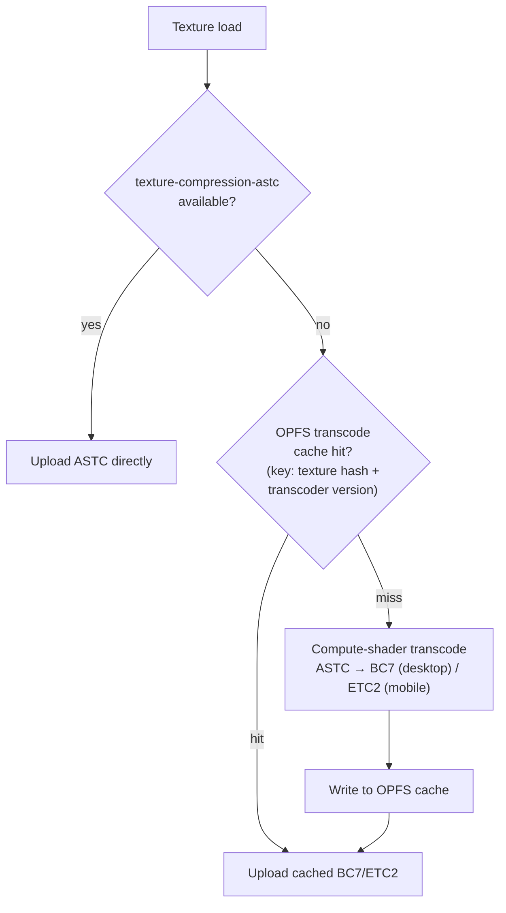

### GPU backend interface

Two tiers, not four backends — hand-written Metal and D3D12 backends **do not exist and will not**:

- **Tier 1 (every platform, web included): one C renderer against the standard `webgpu.h`** — compiled natively linking Dawn or wgpu-native (both implement the header; writing to it keeps either viable), and to WASM via **emdawnwebgpu** for the web. Not Emscripten's `-sUSE_WEBGPU`: that binding is unmaintained and frozen against an old header revision; emdawnwebgpu is Dawn's own Emscripten binding, tracking the stabilized header (futures-based async, string views). One implementation of the texture cache, pipeline cache, and the compute-shader fallbacks for WebGPU's Maxwell gaps (geometry shaders, transform feedback) — the alternative is two complete renderers (TS + C) drifting forever, every golden-image bug debugged twice.
- **Tier 2 (performance, later, one codebase): `GPU_BACKEND_VULKAN`** — Windows/Linux/Android, justified only where device features pay measurably over Tier 1 (native geometry shaders, transform feedback, bindless). Apple via MoltenVK only if profiling ever demands it.

On web, the renderer ships as a **second WASM module instantiated in the GPU Worker**, importing the same shared memory and reading the command ring, completion ring, and guest RAM directly through §4 layout offsets (WebGPU objects are worker-local; all GPU work already lives there). The GPU Worker's TS reduces to module loader, canvas/present glue, WebCodecs decode, and the Phase 3 blit path. The precise rule the old "no webgpu.h on web" statement was protecting survives narrowed: **no WebGPU bindings in the CPU Worker's core module, ever** — the renderer is a separate module in the GPU Worker. The contract between CPU side and renderer is the versioned command stream on every platform. `compile_shader` takes decompiled source; decompiler outputs are **WGSL primary** (Dawn/wgpu ingest it everywhere) and **SPIR-V second** (Tier 2 Vulkan only) — the MSL and HLSL backends are deleted.

Two gates before renderer C is written (Phase 3 spike; clean fallback = the TS drainer, i.e., status quo, never a crisis):

1. **memory64 import is a hard gate:** the renderer module must import the shared memory64 memory — a wasm32 module cannot (memory type mismatch), and copying guest texture/vertex data across a module boundary erases the point. Verify emdawnwebgpu × `MEMORY64` × `SHARED_MEMORY` before anything else — and **audit the generated JS glue for 32-bit truncation idioms**, the real failure class: `>>> 0`, `| 0`, `HEAPU32` indexing, any path keeping 32 bits of a pointer silently corrupts every offset above 4GB, which is where guest RAM lives. (JS Number precision is *not* the issue — 5.25GB addresses fit in 2^33, far under 2^53.) Audit targets: the BigInt↔Number boundary and specifically the data-pointer paths (`writeBuffer`, texture upload, mapped ranges) that take heap offsets into the >4GB region.
2. **Per-call WASM→JS marshalling is measured, not assumed away:** the C renderer pays a trampoline per WebGPU call, thousands per frame on draw-heavy titles, where the TS drainer called the browser API directly. Viable (major engines ship through these bindings) but mitigation vocabulary — render bundles, encoder batching — is designed in from the first command-stream consumer, not retrofitted.

WebGPU-in-worker (transferred OffscreenCanvas, `getContext("webgpu")`, adapter/device, render pass inside a DedicatedWorker) is verified working on current Chromium, Firefox, and Safari 26; the Playwright matrix asserts it per engine as a regression guard, since worker-context capabilities have shifted across Safari point releases before.

Frame interpolation is removed (see §1.5): the premise that motion vectors could be harvested from the Maxwell engine was false.

---

## 14. Audio Pipeline

### Architecture: the worklet reads the ring itself

There is no Audio Worker. `AudioWorkletProcessor` already runs on the browser's real-time audio thread and can read shared memory — inserting a dedicated worker between the ring and the worklet (as v2 did) adds a hop, a copy, and a scheduling hazard for nothing.

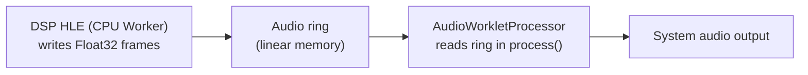

Rules:

- The worklet **never waits** — no `Atomics.wait` on the audio thread. `process()` is invoked on the audio device's schedule; the worklet reads whatever frames are available.
- **Dynamic rate control (the drift mechanism):** the host DAC crystal and virtual-time-paced production are free-running clocks; ppm-scale drift monotonically fills or drains the ring over a session, so a fixed-rate consumer guarantees periodic failure. The worklet resamples by a ratio adjusted from ring-fill error (PI controller, setpoint = half capacity, bounded ±1%) — RetroArch/Dolphin-proven, pitch deviation inaudible, drift absorbed continuously. Native drainers implement the same controller (§3 conformance contract).
- **Underrun policy (backstop, not mechanism):** output silence for the shortfall and increment an underrun counter in the trace buffer. Never block, never stretch. With rate control in place, underruns indicate production stalls, not clock drift.
- The worklet receives the `WebAssembly.Memory` and ring offsets via `processorOptions` at construction.

### Ring layout — specified in frames

The v2 spec measured capacity in "samples" and then computed latency as if they were frames; the number and the unit disagreed. The unit is **frames** (one frame = one sample per channel):

The Switch audio renderer is **48kHz native**. The web side opens `new AudioContext({ sampleRate: 48000 })` and the DSP writes 48kHz frames end to end — no gratuitous resample. If the hardware forces a different rate, the browser resamples once internally; still better than resampling twice.

```
AUDIO_RING_BASE:
  +0   write index (Int32, atomic; in frames, written by DSP)
  +4   read index  (Int32, atomic; in frames, written by worklet)
  +8   Float32 data: capacity_frames × channel_count, interleaved L R L R …

capacity_frames default: 4096  → ~85ms at 48kHz stereo
low-latency target:      2048  → ~43ms; raise if underrun counter climbs
```

### Native backends: drainers, not sinks

One producer path everywhere: **the DSP always writes the ring.** Native backends are ring *drainers* — a callback or thread pulling frames from the same ring into the platform API — exactly what the worklet is on web. This deletes the `submit_frames` push path (two producer conventions is how they drift) and makes the underrun counter meaningful on every platform.

```c
// core/audio/audio.h — native platforms only; web's drainer is the worklet
typedef struct Audio_Backend {
  // Starts draining the audio ring at AUDIO_RING_BASE into the platform
  // output. Same never-wait / silence-on-underrun rules as the worklet.
  void* (*create)(uint32_t sample_rate, uint32_t channel_count,
                  const Memory_Layout* layout);
  void  (*destroy)(void* ctx);
  const char* name;
} Audio_Backend;

extern const Audio_Backend AUDIO_BACKEND_WASAPI;
extern const Audio_Backend AUDIO_BACKEND_COREAUDIO;
extern const Audio_Backend AUDIO_BACKEND_PIPEWIRE;
```

On web, the C side's only job is writing the ring.

---

## 15. Storage Architecture

### What goes where

| Data | Storage | Reason |
|---|---|---|
| Game files (decrypted NCA) | `FileSystemDirectoryHandle` | User owns; never copy multi-GB into browser storage |
| Save data | OPFS | Emulator managed, fast I/O, explicit quota errors |
| Pipeline (shader) cache | OPFS sync access handle (Worker) | Frequent small reads on render hot path |
| Translation cache (PTC) — **WASM bytes** | OPFS sync access handle (Worker) | See §11: bytes only; modules cannot be persisted |
| Downloaded mods | OPFS | Emulator managed |
| Large mod packs | `FileSystemDirectoryHandle` | User owns, read directly |
| Compatibility DB | Compatibility Shared Worker memory | Shared across tabs |
| Settings | IndexedDB | Small structured data |
| Amiibo .bin files | OPFS | Small, emulator managed |
| Transcoded textures | OPFS | Keyed by texture hash + transcoder version |

### Cache keys and invalidation

Validity metadata lives in IndexedDB; blobs live in OPFS.

```typescript
interface TranslationCacheMetadata {
  readonly titleId:         string;
  readonly backendVersion:  string;  // Ballistic semver
  readonly irBuildId:       string;  // invalidates on IR compaction-affecting changes
  readonly entryCount:      number;
  readonly lastUsedAt:      number;  // LRU eviction
  readonly byteSize:        number;
}
```

Per §11: PTC entries are keyed by **content hash of the region's code bytes** + `irBuildId` + `backendVersion`, namespaced by titleId — never by guest address. Pipeline cache entries are keyed by shader-microcode hash + decompiler version (§13).

### LRU eviction

- **Soft cap:** 8 GB total OPFS usage across all caches
- **Eviction trigger:** `QuotaExceededError` on write, or startup check when over soft cap
- **Order:** `lastUsedAt` ascending, per-title
- **Never evicts:** save data, settings, user-supplied content

### "Increase performance for others" toggle (local-only, per §1.6)

- **Off (default):** PTC written to OPFS under normal LRU.
- **On:** larger cap, gentler eviction. Manual export to a file via Settings; manual import of a friend's export via Settings.

Voland never uploads cache data to any server. There is no cloud cache.

### Save backup & sync (cloud providers + companion server)

The olsc IPC service stays stubbed forever (§12); the *feature* — cross-device save continuity — is emulator infrastructure the game never sees, behind one abstraction:

```typescript
// platform/web/src/sync/backend.ts — provider-agnostic
interface SaveSyncBackend {
  readonly name: string;   // "google-drive" | "onedrive" | "companion"
  list(titleId: string): Promise<Result<readonly RemoteSave[]>>;
  pull(save: RemoteSave): Promise<Result<Uint8Array>>;
  push(titleId: string, saveId: string, blob: Uint8Array,
       revision: number): Promise<Result<void>>;
}
```

- **Conflict model** (identical across backends): per-save monotonic revision stored as provider file metadata; push with a stale revision → keep both, surface to the user. Never silent last-write-wins.
- **Backends:** Google Drive (`drive.file` / `appDataFolder` scope), OneDrive (`special/approot`), companion server (§20). All three are "app folder + custom metadata" — that's why one interface fits.
- **OAuth realities:** PKCE SPA flows; client IDs are public and ship with the official PWA, but redirect URIs are origin-locked, so **self-hosters must register their own client IDs** (deployment docs). Only non-restricted scopes (`drive.file`/appdata) — never full-drive — which keeps Voland out of restricted-scope verification audits. Occasional re-auth popups are the accepted design (provider token policies differ; Safari ITP makes silent renewal unreliable) — and they work under §16's strict `same-origin` COOP (required for cross-origin isolation, which severs `window.opener` regardless of COOP value) because the callback page hands the result back via `BroadcastChannel`, not `window.opener`, per §16.
- **Optional E2E encryption:** WebCrypto AES-GCM with a user passphrase, so the provider cannot read saves. Off by default; enabling it shows a "lost passphrase = lost backups" warning.
- **Timing:** pushes hook the save-sync worker's existing OPFS write-serialization point — after write quiesce / session end, never mid-write.

### Filesystem Access API handles — and the non-Chromium fallback

Directory/file handles persist in IndexedDB; permission is re-confirmed once per browser session via `handle.requestPermission({ mode: "read" })`.

The picker methods (`showDirectoryPicker` etc.) are **permanently Chromium-only**: Mozilla holds a negative standards position and Apple has not committed to shipping them. This is a standards split, not a lag — and with WebGPU and memory64 now cross-browser, FSA pickers are the *only* thing between Safari 26 / Firefox users and running Voland, so the fallback is a requirement, not a nicety:

- **Fallback path (Firefox, Safari):** `<input type="file" multiple>` per session. Hold the returned `File` objects; random access works fine via `blob.slice()` for RomFS reads. No persistence — the user re-picks their game files each session, with a one-line banner explaining why. Feature-detect on `"showDirectoryPicker" in window`.
- **Never** fall back to copying multi-GB game files into OPFS.
- Large mod packs on non-Chromium follow the same per-session pattern.

### OPFS sync access handles

Cache reads on hot paths use `createSyncAccessHandle()` inside a Worker — synchronous, no promise overhead. Never the async OPFS API on a hot path. Unchanged from v2.

---

## 16. Web Platform Layer

### Required HTTP headers

**These headers must be set on every response or the entire architecture fails** (no cross-origin isolation → no shared memory):

```
Cross-Origin-Opener-Policy: same-origin
Cross-Origin-Embedder-Policy: require-corp
Content-Security-Policy: frame-ancestors 'none'
```

**Correction (verified against shipping Chromium, not assumed):** an earlier revision of this document specified `same-origin-allow-popups` here on the theory that it both enables `crossOriginIsolated` and lets OAuth popups (§15) retain opener access. Only the second half is true. Tested directly: `same-origin-allow-popups` + `require-corp` yields `crossOriginIsolated === false`; only strict `same-origin` yields `true`. The two properties `same-origin-allow-popups` was chosen for are not jointly available from COOP alone — cross-origin isolation requires the strict value. This is not a regression to fix later; it means Voland was never going to get both from one header, and doesn't need to: the §15 OAuth callback already uses `BroadcastChannel`, not `window.opener` (see "No window messaging API" below), so nothing about the popup flow actually depended on the weaker COOP value. Also **severs cross-origin openers** the same way `same-origin-allow-popups` would have (a cross-origin `window.open("voland.app")` lands in a different browsing-context group; the opener's WindowProxy detaches, postMessage is dead) — that property was never unique to the popups variant. Do not "fix" this back to `same-origin-allow-popups`; it silently disables cross-origin isolation while looking correct in code review.

`frame-ancestors 'none'` is **load-bearing for the consent architecture**, not hygiene: an embedding iframe gets a message channel and, worse, UI redressing of the §19/§20 consent prompts — a clickjacked consent button defeats every override/bridge/CA control in the system. The main build is never embeddable; the sole exception is the kiosk build below, which is embeddable precisely because those consent surfaces don't exist in it.

### Kiosk build (build-time flag, self-host only)

A separate build artifact for creators previewing **their own homebrew** (Patreon-preview pattern: embed a playable build on their own site). Shaped as a *reduction* of surface, never an addition of API:

- **Build-time, separate artifact.** `-DKIOSK=1` produces it; the official deployment never ships it, dormant or otherwise — compiled-out code cannot be socially engineered on ("enable the flag to use our integration" has no target on the main instance).
- **Pinned title (or small picker), auto-boot.** Library, settings, repositories, save-sync configuration, server directory, override sets: **absent from the bundle**, not hidden.
- **NRO only — the line that makes this shippable.** A kiosk instance serves its title from its own origin, i.e., it is a hosted-game player. Restricted to the homebrew format, that means creators distributing their own work; accepting NCA would make it a first-party piracy-portal frontend whose predominant foreseeable use violates §1.6's spirit. Commercial titles structurally cannot be repackaged as NROs; the loader in this build refuses everything else.
- **Embedding allowed, operator-scoped:** the operator configures a `frame-ancestors` allowlist for their site. Safe here and only here — no consent prompts exist to clickjack.
- **Embedding is technically expensive for the embedder — say so up front.** A `crossOriginIsolated` iframe requires the **embedder's top-level page** to serve COOP+COEP and delegate `allow="cross-origin-isolated"` on the frame; COEP breaks every non-CORP resource that page loads (video embeds, ad scripts, most CDN images). Consequences, in order of recommendation: (1) **standalone kiosk page + link** (styled, branded via `kiosk.json`) — zero embedder burden, what most creators should do; (2) **same-origin embedding** (kiosk served under a path of the creator's origin) — the page still pays COI but no cross-origin delegation; (3) cross-origin iframe — only for sites prepared to go fully cross-origin-isolated. Without this note the kiosk build generates "SharedArrayBuffer undefined in my iframe" reports forever.
- **Scroll-out pause needs no messaging:** the kiosk self-observes top-viewport intersection (`IntersectionObserver`, implicit root — the ad-visibility mechanism) and auto-pauses when scrolled out — closing the one legitimate "but embedders need a pause API" objection without a listener.
- **Configuration, not messaging:** a static `kiosk.json` served by the instance (title, branding, control hints) covers everything an embedding page legitimately needs. **No postMessage API exists in this build either** — the §16 no-window-messaging rule is unconditional; the kiosk use case is declarative start-state, which is config, not conversation.
- Saves persist in the kiosk origin's OPFS (patrons keep progress); the origin split means nothing from a user's main Voland — tokens, library, handles — exists on the creator's instance.
- The §16 link parameters are **not recognized** in this build: `?add-repo=` has no UI to open, and `?join=` presumes companion-server configuration that doesn't exist here. The kiosk parses zero query parameters.

### No window messaging API

There is no postMessage configuration surface, and none will be added. The sanctioned link actions (`?add-repo=`, `?join=` above) already have a channel — the URL: static, address-bar-visible, one-shot, user-initiated. Window messaging is that channel minus every one of those properties — invisible, repeatable, programmatic — i.e., automation of exactly the flows this design makes deliberately manual. With COOP severing openers and `frame-ancestors 'none'` banning embedders, no legitimate sender exists.

Enforcement is structural: **zero `message` listeners on window/document anywhere in the codebase** (review-greppable; worker-scoped postMessage is unaffected). The one flow that traditionally wants opener messaging — the §15 OAuth popup callback — uses `BroadcastChannel` instead: same-origin by construction, validated against the PKCE state nonce, so no window listener ever exists to attack or to scope-creep.

Set in hosting config AND re-injected by the Service Worker on cached responses. **The SW-injection path requires one reload:** on the first-ever visit, the SW isn't controlling the page yet, so `crossOriginIsolated` is false even after registration. Boot handles this explicitly (step 2 below) — without it, self-hosted deployments file "SharedArrayBuffer undefined" bugs forever. Self-hosters should set real headers and treat SW injection as fallback only; this is documented in the deployment notes.

### Boot sequence

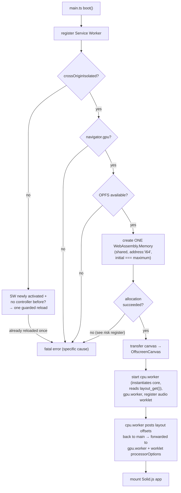

```typescript
// platform/web/src/main.ts (abridged)
async function boot(): Promise<void> {
  if ("serviceWorker" in navigator) {
    await navigator.serviceWorker.register("/sw.ts", { type: "module" });
  }

  if (!crossOriginIsolated) {
    // First visit under SW-injected headers: reload once so the SW controls
    // the page. Guarded to prevent loops; real headers make this a no-op.
    if (!sessionStorage.getItem("coi-reload-attempted")) {
      sessionStorage.setItem("coi-reload-attempted", "1");
      await navigator.serviceWorker.ready;
      location.reload();
      return;
    }
    showFatalError("Cross-origin isolation is not active. Ensure the server sets COOP and COEP headers.");
    return;
  }

  if (!("gpu" in navigator)) {
    showFatalError("WebGPU is not available. Update your browser (WebGPU is Baseline since Jan 2026: Chrome/Edge 113+, Safari 26+, Firefox 141+; Firefox on Linux/Android is still rolling out).");
    return;
  }
  if (!("storage" in navigator) || !("getDirectory" in navigator.storage)) {
    showFatalError("Origin Private Filesystem (OPFS) is not available.");
    return;
  }

  // ONE memory. Guest RAM lives inside it (§4). No separate SABs.
  //
  // Corrected against the shipped API (Phase 0 implementation, verified
  // against both V8 and Emscripten's own -sMEMORY64=1 glue output): the
  // descriptor key is `address: "i64"` with BigInt page counts, not
  // `index: "i64"` with Number page counts as earlier drafts of this
  // section had it. `index` is silently ignored as an unrecognized
  // property - the memory it produces is an ordinary 32-bit one, which
  // then throws RangeError the instant TOTAL_MEMORY_PAGES exceeds the
  // wasm32 cap of 65536 pages (4GiB), which it always does here.
  let memory: WebAssembly.Memory;
  try {
    memory = new WebAssembly.Memory({
      initial: TOTAL_MEMORY_PAGES,   // BigInt; ≈ 5.25GB in 64KB pages
      maximum: TOTAL_MEMORY_PAGES,   // fixed: views never detach
      shared:  true,
      address: "i64",                // memory64
    } as WebAssembly.MemoryDescriptor);
  } catch {
    showFatalError("Could not allocate emulator memory (~5.25GB). Your browser or device limits shared memory; use a native build.");
    return;
  }

  const canvas    = document.getElementById("game") as HTMLCanvasElement;
  const offscreen = canvas.transferControlToOffscreen();

  const cpuWorker = new Worker("workers/cpu.worker.ts", { type: "module" });
  const gpuWorker = new Worker("workers/gpu.worker.ts", { type: "module" });

  cpuWorker.postMessage({ type: "init", memory });
  // cpu.worker instantiates the core module with `memory`, calls
  // emulator_create() → layout_get(), and posts the layout back:
  const layout = await onceMessage<MemoryLayout>(cpuWorker, "layout");

  gpuWorker.postMessage({ type: "init", canvas: offscreen, memory, layout }, [offscreen]);

  const audioContext = new AudioContext({ sampleRate: 48000 }); // Switch-native rate (§14)
  await audioContext.audioWorklet.addModule("worklets/audio-output.worklet.ts");
  const node = new AudioWorkletNode(audioContext, "voland-audio-output", {
    processorOptions: { memory, audioRingBase: layout.audioRingBase },
  });
  node.connect(audioContext.destination);

  startInputWriter(memory, layout);  // §18: seqlock writes each rAF
  mountApp({ cpuWorker, gpuWorker, memory, layout });
}
```

### Visibility handling

`requestAnimationFrame` stops in hidden tabs, freezing input writes; audio may keep pulling. Emulation **auto-pauses on `visibilitychange` to hidden** (a lifecycle postMessage to the CPU worker) and resumes on visible. This is the policy, written down so nobody "fixes" the frozen-input symptom instead.

### Routing

Navigation API intercepts client-side navigation; the Service Worker serves `index.html` for all navigate requests (hard refresh at `/game/:titleId` works). Route table and `startViewTransition` wrapping as in v2:

```typescript
const routes = [
  { pattern: /^\/$/, view: "library" },
  { pattern: /^\/settings(\/(graphics|controls|audio))?\/?$/, view: "settings" },
  { pattern: /^\/game\/([0-9A-Fa-f]{16})\/?$/, view: "game", param: "titleId" },
  { pattern: /^\/game\/([0-9A-Fa-f]{16})\/(saves|mods)\/?$/, view: "game-sub", param: "titleId" },
  { pattern: /^\/compatibility\/?$/, view: "compatibility" },
] as const;
```

### Link parameters — prefill, never perform

Exactly two query parameters are recognized; both open the corresponding manual UI pre-filled, mutate nothing before the user acts, and label the prompt as externally linked with zero inherited trust:

- `?add-repo=<https-url>` — opens the §19 add-repository prompt ("Add to Voland" buttons on community sites).
- `?join=<room-code>` — opens the §20 room-join flow (multiplayer invite links). Codes are short-TTL rendezvous values; the param must never be reused for long-lived secrets (URLs leak via history and referrer).

Rules: **references only, never payloads** — no inline manifests, host lists, or base64 blobs (rejected at parse; untraceable inline data bypasses the repo accountability model). One pending link-prompt at a time. Params arriving during active emulation queue to the library view — a link never raises a consent prompt over gameplay. **Nothing else is URL-addressable, categorically:** servers, DNS overrides, CA trust, bridge approvals, and sync backends are reachable only through their entry-driven consent flows; a query param into those prompts is an attacker-composable deep link that prompt fatigue converts into approval. Auto-add with undo is prohibited — undo-framing is perform-then-ask.

### Worker message protocol — lifecycle only

Per §6, per-frame data (input, frames, audio, GPU commands) never travels over postMessage. What remains:

```typescript
// Main → CPU Worker
type MainToCPUMessage =
  | { type: "init";       memory: WebAssembly.Memory }
  | { type: "load-game";  titleId: string; fileHandle: FileSystemFileHandle }
  | { type: "pause" } | { type: "resume" }
  | { type: "save-state"; slot: number } | { type: "load-state"; slot: number }
  | { type: "controller-connected";    index: number; profileId: string }
  | { type: "controller-disconnected"; index: number };

// CPU Worker → Main
type CPUToMainMessage =
  | { type: "layout";      layout: MemoryLayout }
  | { type: "fps";         value: number }
  | { type: "game-loaded"; titleId: string; title: string }
  | { type: "error";       message: string }
  | { type: "halted" };

// Main → GPU Worker
type MainToGPUMessage =
  | { type: "init";   canvas: OffscreenCanvas; memory: WebAssembly.Memory; layout: MemoryLayout }
  | { type: "resize"; width: number; height: number };

// CPU Worker ↔ Compiler Worker (dedicated, §11: region granularity)
type CPUToCompilerMessage = {
  readonly requestId: number;
  readonly titleId:   string;
  readonly cacheKey:  string;      // hash(code bytes) + irBuildId + backendVersion
  readonly wasmBytes: Uint8Array;  // emitted region module bytes
};
type CompilerToCPUMessage =
  | { readonly requestId: number; readonly module: WebAssembly.Module }
  | { readonly requestId: number; readonly error: string };
```

### Service Worker

Cache strategy unchanged from v2 (shell cache-first, `.wasm` aggressively cache-first, `/api/` network-only, rest network-first) with `addCrossOriginIsolationHeaders()` applied to every served response.

### Progressive enhancement

Capability detection (`webGPU`, `opfs`, `crossOriginIsolated`, `showDirectoryPicker`, WebHID, WebNFC, wake lock, vibration) as in v2; hard requirements fail at boot, the rest degrade per-feature.

---

## 17. Native Platform Layers

All native platforms link the C core directly. No IPC between UI and core — function calls through the backend vtables. On native, §4's linear memory is one large anonymous mapping; the layout code is identical.

### Platform matrix

| Platform | UI | Renderer | Audio | JIT path | Distribution |
|---|---|---|---|---|---|
| Web | Solid.js | WebGPU | AudioWorklet (§14) | WASM bytecode | URL / PWA |
| iOS / iPadOS | SwiftUI | WebGPU-native (Dawn→Metal) | CoreAudio | needs `dynamic-codesigning` | Sideload (AltStore) |
| tvOS / visionOS | SwiftUI (+focus / RealityKit) | WebGPU-native (Dawn→Metal) / CompositorServices | CoreAudio | same as iOS | Sideload |
| Android / Android TV | Jetpack Compose | WebGPU-native (Dawn→Vulkan); Vulkan tier 2 | AAudio | mmap + mprotect | APK sideload |
| macOS | SwiftUI | WebGPU-native (Dawn→Metal) | CoreAudio | mmap + mprotect | Direct download, notarised |
| Windows | Qt over voland-cli core | WebGPU-native (Dawn→D3D12); Vulkan tier 2 | WASAPI | VirtualAlloc | Direct download |
| Linux | Qt over voland-cli core | WebGPU-native (Dawn→Vulkan); Vulkan tier 2 | PipeWire | mmap + mprotect | Direct download |

**Desktop UI is Qt, deliberately.** WinUI 3 + GTK would replace one codebase with two (and add C++/WinRT) for zero functional gain — and Voland already carries SwiftUI, Compose, and Solid.js. UI count is a **security variable**: every toolkit reimplements the §19/§20 consent flows, whose wording and structure are load-bearing. All UI implementations render those screens from a normative spec, `docs/CONSENT_FLOWS.md` — toolkit divergence in consent language is a review rejection.

### UI strategy: share logic, not pixels

The four UI codebases are already family-level abstractions — SwiftUI (5 Apple targets), Compose (Android + TV), Qt (Windows/Linux), Solid (web): four codebases, ten targets. Cross-platform toolkits don't beat that arithmetic here, and proposals get redirected to this section:

- **React Native**: RN-Windows/macOS in maintenance limbo, tvOS a community fork, no Linux, and react-native-web would rebuild the flagship PWA on RN's weakest target. SwiftUI and Solid survive anyway → merges ~1 codebase, adds a JS runtime and Metro/bridge tooling to every native build.
- **Flutter**: canvas-rendered web (disqualifying for the primary PWA), no tvOS/visionOS, weak D-pad focus — the entire interaction model of the living-room targets — plus Dart in the stack.
- **A bespoke abstractor**: a UI framework project inside an emulator project, serving a thin chrome (library grid, settings, mod manager, consent dialogs). No.
- Under *any* abstractor, the hard seams stay per-platform native: render-surface embedding (Dawn swapchain), input latency path, file access. Toolkits abstract the chrome and complicate the seams.

What actually kills duplication:

1. **Settings are a schema, not screens** — one declarative definition (keys, types, ranges, dependencies, per-platform visibility) rendered by a generic form renderer per toolkit: written once + four thin renderers.
2. **Consent flows are state machines in CONSENT_FLOWS.md** — states, mandatory displayed fields, transition guards — with conformance tests per UI, converting "divergence is a review rejection" from reviewer vigilance into a CI check.
3. **Models live in the core**; toolkits render state, never own it.

One consolidation has defensible arithmetic and is the named Phase 8 revisit option if Qt friction materializes: **Compose Multiplatform** — already in the stack, CMP iOS stable, Compose Desktop retires Qt (→ three codebases) at the price of a bundled JVM on desktop. Not adopted now; recorded so the next toolkit proposal is compared against the one that could actually merge more than it adds.

### voland-cli: the first desktop artifact

The desktop core ships first as a CLI with **zero Qt dependency** — because the test infrastructure requires it, not as a convenience: Phase 3/4 golden-image tests and interpreter-vs-JIT differential runs need a headless runner (offscreen render-to-texture via Dawn, hash, exit code). Subcommands: `run` (headless or windowed), `verify-dump` (hash-check decrypted input without booting), `ptc-precompile`, `cache` (inspect/evict), `save-export`/`save-import`. CI links voland-cli, never a GUI toolkit. The Phase 8 Qt app is a frontend over the same core — by then battle-tested by every CI run since Phase 3 — and the CLI doubles as the integration point for launcher frontends (EmulationStation-class).

**Xbox is demoted from the committed matrix to exploratory.** Three reasons, each sufficient: Dev-Mode sideloaded apps are memory-capped on older hardware well below Voland's ~5GB working set (must be re-verified against current caps per console generation before any commitment); the WinUI 2 / UWP stack is deprecated; and it competes for effort with platforms that reach more users. Two more make it categorical: JIT is Dev-Mode-only (retail UWP bans dynamic code generation, so distribution is a null set), and even the browser path fails — Edge on Xbox lives under the same memory regime, so the boot-time ~5.25GB allocation is refused at step one. **The exit condition is platform convergence, not porting effort:** if Microsoft's Windows/Xbox convergence direction ships consoles that run Windows applications, the Windows build works there unmodified and this row resurrects for free. Until then, no Xbox-specific code is written.

### iOS JIT entitlement

Without `dynamic-codesigning` (sideload-only), dynamic `WebAssembly.compile()` is throttled and performance is interpreter-level. Apple can revoke the path by policy — §28.

```xml
<!-- ios/Entitlements.plist, sideload build only -->
<key>dynamic-codesigning</key>
<true/>
```

---

## 18. Input Handling

### Transport: seqlock region in linear memory, not postMessage

v2 forwarded gamepad state via postMessage every rAF: per-frame allocation, a task-queue hop of latency, and dead input in throttled tabs. Replaced by direct shared-memory writes:

```
INPUT_REGION_BASE: per controller slot (×8):
  +0    sequence counter (u32, atomic)   // seqlock
  +4    buttons bitmask  (u32)
  +8    axes             (8 × i16)
  +24   flags            (u32: connected, profile id)
```

- **Main thread (writer), each rAF:** bump sequence to odd → write payload → bump to even (release ordering).
- **CPU Worker `hid:` service (reader), at guest HID poll rate:** read sequence (acquire); if odd, or changed across the payload read, retry. No torn reads, no waiting, no allocation.
- Connect/disconnect/profile changes go over postMessage (lifecycle events, §16).

Hidden-tab behavior is covered by the auto-pause policy in §16.

### Sources

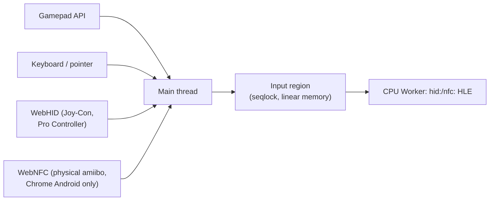

### Controller mapping

Switch A/B and X/Y are swapped relative to the Standard Gamepad (Xbox) layout:

```typescript
const STANDARD_MAPPING: ControllerProfile = {
  name: "Standard",
  buttonMap: [
    1, 0,   // A↔B
    3, 2,   // X↔Y
    4, 5, 6, 7,      // L R ZL ZR
    8, 9, 10, 11,    // Minus Plus LStick RStick
    12, 13, 14, 15,  // D-pad
    16,              // Home
  ],
};

// Pro Controller via WebHID: 1:1, no remap
const PRO_CONTROLLER_HID: ControllerProfile = {
  name: "Switch Pro Controller", vendorId: 0x057E, productId: 0x2009,
  buttonMap: Array.from({ length: 32 }, (_, i) => i),
};
```

WebHID Joy-Con access (filters for 0x057E/0x2006–0x2009) and HD Rumble report forwarding as in v2 — progressive enhancement, Chrome-only, skipped silently elsewhere.

**npad style negotiation:** games request style sets per slot (single-Joy-Con horizontal, dual, pro, handheld); the hid shared-memory writer (§12) honors the requested style, including the button/axis remap horizontal single-Joy-Con implies. Designed in now — a retrofit touches every mapping table.

---

## 19. Mod System

### LayeredFS

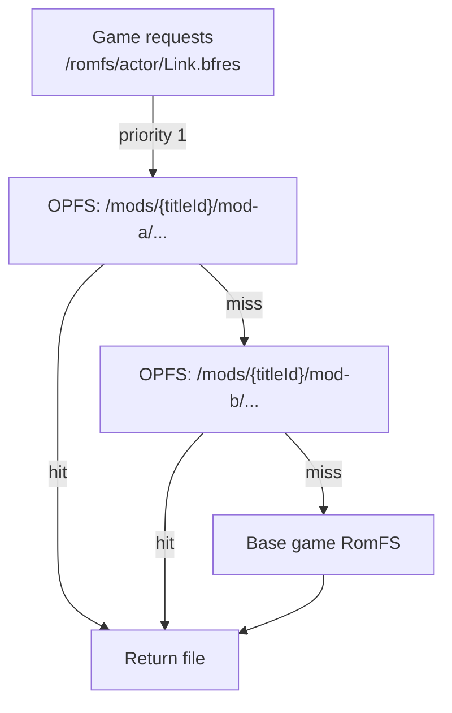

```typescript
interface ModMetadata {
  readonly id: string; readonly titleId: string;
  readonly name: string; readonly version: string;
  readonly enabled: boolean;
  readonly priority: number;      // lower = higher
  readonly sizeBytes: number; readonly installedAt: number;
  readonly source: "opfs" | "filesystem-handle";
  readonly sourceRepo?: string;   // repo URL if installed from a repository (below)
  readonly targetGameVersions?: readonly string[]; // title versions this mod targets
}
```

### Mod repositories (add-a-repo model)

Users add repositories by URL — a manifest-driven install/update mechanism modeled on Home Assistant add-on repos. Three constraints define it; each is a hard rule, not a v1 deferral.

**Voland ships zero repos.** No default repo, no featured/curated list, no built-in directory, no Voland-run index. Switch mod repos are saturated with Nintendo-derived assets; a default or curated repo makes Voland a distributor of that content — the §1.6 pattern. Voland ships only the *mechanism* (URL field + manifest spec), exactly the posture of the §20 DNS hook. The HA analogy breaks precisely here: HA can ship a default repo because automation containers aren't third-party IP.

**Guest-side content only; no host-side code — categorically.** The mod *type* is the security boundary:

- **Permitted (guest-side data):** RomFS/exefs replacements, IPS/pchtxt patches, and even executable *guest* code (NRO-style mods). To the host it is all data; it executes inside the emulated ARM sandbox. Worst case is whatever that title's HLE surface allows — its saves, its LDN traffic during a session — the user's informed choice, stated at its actual ceiling rather than a comfortable subset. Untrusted input to the LayeredFS/loader parsers, same as a locally-installed mod.
- **Excluded (host-side code):** no JS plugins, no wasm plugins, no UI extensions, no theme scripts. Host-side plugin code would run in the origin holding OPFS saves, persistent FS handles, and (§15) the user's cloud-storage OAuth tokens — one malicious repo entry = account-scoped compromise. There is no host sandbox for mods and none will be built; this is not deferred, it is excluded. (HA runs arbitrary add-on code *because* it has container isolation Voland's page context does not.)

**Repos must be CORS-enabled** (`Access-Control-Allow-Origin: *`) — required for CORS-mode fetch under the page's COEP (§16). GitHub raw/Pages/releases satisfy this and are where these repos live. **No Voland CORS proxy will ever be added**: a proxy relaying mod fetches is Voland distributing the content it carries (§1.6). A repo that isn't CORS-enabled is the repo's bug, surfaced to the user as such.

Manifest and flow:

```typescript
// repository.json at the repo root; entries keyed by titleId
interface ModRepositoryManifest {
  readonly schemaVersion: 2;   // v2 adds `servers`; v1 clients ignore it
  readonly name: string;
  readonly entries: readonly {
    readonly titleId: string;
    readonly modId: string;
    readonly name: string;
    readonly version: string;                       // semver; drives updates
    readonly type: "romfs" | "exefs-patch" | "cheats" | "guest-nro"; // NO host-code types
    readonly targetGameVersions: readonly string[]; // title versions supported
    readonly buildId?: string;   // REQUIRED for exefs-patch and cheats: NSO build ID
                                 // (Atmosphere convention). Version strings don't map
                                 // reliably to builds; buildId is authoritative.
    readonly artifactUrl: string;                   // .zip/.7z, same CORS rule
    readonly sha256: string;                        // mandatory, verified pre-extract
    readonly sizeBytes: number;
  }[];
}
```

- **Install:** fetch artifact → verify SHA-256 (reject on mismatch) → extract to OPFS → register with `sourceRepo` provenance. Trust root is the repo URL over HTTPS + the per-artifact hash; no signing/PKI in v1 (community-repo key management is complexity nobody operates correctly).
- **Update:** refetch manifest, compare versions in the ModManager, show available updates. `targetGameVersions` gates visibility so a title update doesn't silently enable a now-broken mod — the mismatch is shown, not hidden.
- **Matching:** for `exefs-patch` and `cheats`, the loaded NSO's build ID (extracted at §12 bootstrap) is the authoritative match; `targetGameVersions` is advisory display metadata. A buildId mismatch disables the entry with a visible reason — mis-applied executable patches are crash generators, never applied on version-string faith.
- **Repo list** lives in IndexedDB settings; adding/removing a repo never touches installed mods.

### Server directory entries (schemaVersion 2)

Repos may also advertise servers. **A server entry is a directory listing, not a distribution** — mods are static and hash-verifiable; servers are live infrastructure whose behavior no manifest can attest. Capabilities are claims. The rules that keep this from becoming a trust-laundering machine:

1. **Zero conveyed trust.** Advertised servers render as untrusted third-party infrastructure; repo provenance is shown, never framed as endorsement. Adding a repo connects to nothing; using an advertised server is a separate explicit action — with a first-use disclosure stating what that capability exposes: `signalling` learns your IP, the title, and session metadata, and joining public rooms delivers strangers' LDN packets to your *guest* (the accepted sandbox — identical to local wireless with a stranger); `turn` relays see DTLS ciphertext only; `game-server` gets the full §20 consent flow.
2. **Never save-sync.** Repo entries may advertise `signalling` / `turn` / `game-server`; the §15 save-sync backend list never auto-populates from repos. Saves go only where the user deliberately typed — data-gravity bright line.
3. **`game-server` entries feed the §20 hook** through the per-title consent flow defined there; the entry carries the titleIds, host overrides, and CA (by SHA-256 + URL) that flow presents.
4. **Verified where possible:** capabilities with a handshake (companion API version, TURN allocation probe) are checked at add-time; everything else displays as *unverified claim*.
5. **Transport honesty:** entries carry `transports`; the web client filters to browser-reachable ones (see §20 — raw TCP/UDP game servers are unreachable from a browser without a server-side WS/WebTransport bridge). Entries without a web transport show as native-only, not as silent failures.
6. **Third-party bridges are listable, destination-scoped, never Voland's.** A `bridge` entry is a third-party relay making native-only servers web-reachable — the TURN precedent generalized. Mandatory constraint: `bridgeFor` declares exact destination hosts, **no wildcards, client-enforced** — a scoped relay is game-server-adjacent infrastructure; an open proxy is refused at parse time. Composition is automatic: any `game-server` entry whose endpoints fall inside a bridge's allowlist can use it.
   **Destination approval is default-deny and need-driven.** Routed set = `bridgeFor` ∩ user-approved hosts, client-enforced. The approval unit is the **(title, game-server, bridge) triple**: consenting to a game-server entry that needs a bridge auto-computes the intersection of that server's endpoints with the bridge's allowlist and presents exactly those hosts, individually listed — never more hosts than the chosen server uses, so a 500-host bridge never produces a 500-checkbox prompt. Approval writes one record into the title's §20 override set (same provenance/toggle/revert machinery; no second approval store). Manual per-host approval exists as the advanced path when no game-server entry drives it. **Domain grouping is display-only collapse — group-level approval toggles are prohibited**: one click on "*.example.net (487 hosts)" is wildcard consent in a costume, laundering exactly what the parse-time rule refuses.
   Consent names **both** operators (bridge and server), and states plaintext honestly: TLS guest traffic (`ssl:` to a CA-pinned server) transits the bridge as ciphertext; plain-socket protocols are readable and modifiable by the bridge operator. Blast radius remains gameplay data only (never-connect rule: no real credentials exist in the guest). Voland still operates and recommends no relay, ever.

```typescript
readonly servers?: readonly {
  readonly serverId: string;
  readonly name: string;
  readonly capabilities: readonly ("signalling" | "turn" | "game-server" | "bridge")[];
  // "turn" implies ephemeral credential vending via the companion API at
  // `endpoints` (apiVersion handshake). Static TURN credentials are not
  // expressible in this schema — public creds in a public manifest are
  // relay-abuse fuel.
  readonly endpoints: readonly string[];
  readonly transports: readonly ("tcp-udp" | "websocket-bridge" | "webtransport")[];
  readonly apiVersion?: string;              // companion handshake target
  readonly titleIds?: readonly string[];     // game-server: scoped titles
  readonly hostOverrides?: readonly string[];// game-server: hostnames to redirect
  readonly ca?: { readonly sha256: string; readonly url: string }; // guest ssl: store ONLY
  readonly bridgeFor?: readonly {            // REQUIRED for "bridge"; NO wildcards —
    readonly host: string;                   // exact hostnames, enforced client-side.
    readonly ports?: readonly number[];      // omitted = any port on that host
  }[];
  readonly contact?: string;
}[];
```

### Archive extraction (client-side, no server)

| Format | Library |
|---|---|
| `.zip` | fflate (pure JS) |
| `.7z` / `.rar` | libarchive.wasm |

Extract to OPFS on install. Large packs (>500MB) stay as Filesystem Access handles and are read directly — never copied.

---

## 20. Multiplayer & Companion Server

The Switch has three multiplayer surfaces. They hit different service layers; conflating them is how emulators end up with half-working co-op.

1. **Same-console** (up to 4 players, one instance — split Joy-Con, passed controllers). Not networking at all: `hid:` multi-npad + the **controller applet** ("Change Grip/Order" player-select — a blocking library applet, §12 stub map) + npad **style negotiation** (§18). Input plumbing lands Phase 4; the applet overlay lands with the Phase 6 stub tier — until then, titles that mandate the applet can't start player 2.
2. **Local wireless (LDN)** — the `ldn:` service, tunneled peer-to-peer over WebRTC. The subsections below.
3. **Internet play** — split into three honestly distinct cases:
   - **Distant local-wireless** (the RyuLDN pattern): playing a title's *local-wireless mode* with far-away people is not a new subsystem — same `ldn:` service, same WebRTC relay, remote room code via companion-server signalling. This is what "online multiplayer in an emulator" has always actually meant. It does **not** unlock titles' NSO online modes — Animal Crossing's internet visits, Splatoon's online lobbies, and anything else Nintendo-stack-gated stay dead; the game must have a local-wireless mode.
   - **LAN mode** (MK8DX/Splatoon-class explicit LAN modes): plain `bsd:` sockets, no Nintendo backend — implementable, see the LAN-mode subsection below.
   - **Nintendo's online stack** (NPLN/Pia sessions, NSO auth, `friends:`): stays stubbed (§1.5 non-goal), **and — hard rule — Voland never connects to Nintendo's real servers** for any purpose: it requires real account credentials, violates ToS, exposes users to account/console bans, and re-enters the posture §1.6 exists to avoid. Voland ships zero Nintendo endpoints. `nifm` reports connectivity per the §12 stub map; NSO-gated modes fail honestly.

### Local wireless (LDN) transport

WebRTC DataChannel with unreliable transport (UDP semantics) matching the Switch LDN latency profile.

**Who runs the signalling server:** earlier revisions showed a signalling server without saying who operates it — an unresolved contradiction with §1.6's no-servers posture. Resolved: signalling is a function of the **user-hosted companion server** below. Voland runs no instance.

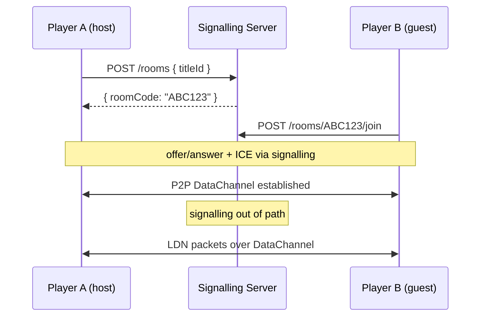

LDN packets are intercepted at the service boundary (`ldn_on_send_packet` / `ldn_deliver_packet` in `core/hle/services/network/ldn.c`); the game never knows it isn't on local WiFi. Symmetric NAT breaks P2P; users can configure their own TURN server (recommended: Coturn) in Settings — default is P2P-only. Known limitation: WebRTC timing differs from WiFi LDN; frame-perfect fighting games may behave differently (§28).

### The companion server (`companion/`, user-hosted, optional)

A single Node.js process + SQLite, configured in Settings by URL + user-generated bearer token. No accounts, no default URL, no telemetry. For most users the cloud-provider sync backends (§15) cover save continuity with zero infrastructure; the companion server exists for the functions no third-party provider can host, plus a self-sovereign sync option:

1. **LDN signalling + room codes** — the §20 flow above. Session metadata only.
2. **Save sync backend** — one `SaveSyncBackend` implementation among several (§15); same revision/conflict model.
3. **TURN pairing** — hands the client credentials for a coturn the user also self-hosts.
4. **WebSocket presence channel** — reserved; where an npns-lite would live if a friends/rooms layer ever exists. npns stays stubbed until then.

**Data rule (§1.6):** user-owned data only — saves, room codes, session metadata. No game files, no caches, no bcat payloads, ever.

**Web-platform requirements the server template MUST satisfy** (each is opaque breakage for self-hosters otherwise):

- `Cross-Origin-Resource-Policy: cross-origin` + standard CORS on every response — Voland pages run COEP `require-corp` and silently reject responses without it.
- TLS or localhost — the PWA is HTTPS; plain `http://LAN-IP` is mixed content, blocked outright (and PNA preflights presuppose a connection the mixed-content block never allows to start). The server bundles a **one-command cert utility** — generates CA + server cert for the LAN address, prints per-OS/per-browser trust-installation steps — because raw-LAN-IP self-hosters (NAS, secondary PC) are the common case, and a documented flow they must assemble themselves is a step most won't complete. Users self-hosting the PWA can co-host.
- `Access-Control-Allow-Private-Network: true` on preflights — Chromium's Private Network Access gate for public-page→LAN-address requests.

The emulator↔server protocol is versioned in `docs/COMPANION_API.md`; server responses are untrusted input (parsed defensively, never executable, never auto-applied configuration).

### LAN mode (surface 3, implementable subset)

Titles with explicit LAN modes speak plain BSD sockets. The `bsd:` HLE gets a pluggable transport:

- **Native:** guest sockets map to real OS sockets — LAN mode works against other Voland instances (or real consoles) on the network.
- **Web:** guest sockets tunnel over the surface-2 WebRTC room (same signalling, same mesh). TCP → a reliable-ordered DataChannel per connection; UDP → the unreliable channel. The non-obvious piece: LAN discovery is **UDP broadcast**, emulated as fan-out to every room peer.

### Community-server hook (hook, not feature)

The established mechanism for third-party server reimplementations is DNS redirection: `sfdnsres` **host-override sets** plus an `ssl:` service that can accept user-imported trusted CAs. Voland specifies the hook and ships **no overrides, no endpoints, no bundled CAs**; per-game community-server support remains a non-goal. The hook exists so advanced users aren't architecturally locked out — and so nobody is tempted to hardcode the alternative.

Mechanics, tightened now that §19 server entries can feed this hook:

- **Overrides are per-title sets, not a global table** — bound to titleIds, active only while that title runs, provenance-tracked (`sourceRepo` or "manual"), one toggle to disable, one action to remove. A global override table was always the worse design.
- **Consent flow states exactly what changes:** "route these N hostnames for title X to host Y; trust CA Z *inside the emulated console only*; active while X runs" — and when a bridge carries the connection, the same prompt names the bridge operator and lists the exact approved destination hosts (the (title, server, bridge) approval unit, §19 rule 6). The fetched CA bytes are verified against the manifest's SHA-256 **before** the consent prompt renders — hard reject on mismatch; the hash in the manifest is what the user consents to, not whatever the URL currently serves. CA trust lands in the emulated `ssl:` store exclusively — never the host trust store; blast radius is that title's guest traffic, which contains no real Nintendo credentials because the never-connect rule means the guest never holds NSO tokens.
- **Web transport reality:** browsers cannot open raw TCP/UDP, so a community game server is unreachable from web Voland unless the server terminates a WebSocket/WebTransport bridge. The `bsd:` pluggable transport gains a third backend (WS/WebTransport bridge) alongside OS sockets and the LAN-mode WebRTC tunnel; §19 entries declare `transports` and the web client filters accordingly. Servers that want web users run the bridge themselves, **or** a repo-listed third-party scoped bridge (§19 rule 6) covers them — either way the bridge is someone's infrastructure, never Voland's; native Voland connects directly.
- **Fail-closed egress — the load-bearing rule.** The guest has no general internet; enabling a server entry must not create it. The internet-capable `bsd:` backends are reachable **only** for destinations resolved through the active entry's `hostOverrides` — default-deny, the entry is the sole allow. Non-overridden hostnames (Nintendo's included) fail resolution; nothing falls through to real Nintendo servers, and the entry's pinned CA is consequently only ever exercised against hosts the entry already names.
- **Re-consent on change.** A repo update that alters an entry's `endpoints`, `hostOverrides`, or `ca` deactivates it and re-prompts with a diff of exactly what changed. Consent is to a specific routing configuration, not to an operator in perpetuity.

**Title-specific UGC sharing (design/creator IDs, dream addresses, level codes, plaza posts) — canonical answer:** not implementable in Voland, structurally. These IDs are keys into Nintendo's databases, assigned server-side — interop with real codes requires querying Nintendo's servers (hard rule above). A Voland-namespace equivalent would pass the §1.6 data rule (the content is user-created) but has no delivery path: making the in-game UI consume it means per-title server-protocol reimplementation (this section's named non-goal), and emulator-side save injection means implementing Nintendo's save-encryption schemes in-repo (§1.6 — the game's own code does its save crypto inside the emulator; Voland never does). What's coverable is already covered: save sync moves your own UGC across your devices; LDN visits show it live; and if a community project ever reimplements a title's portal protocol, this hook is how users reach it with zero per-game code in Voland. Proposals in this category get redirected here.

---

## 21. Amiibo

Virtual amiibo: `.bin` files in OPFS injected into the `nfc:` HLE service, or generated from the public amiibo API. Physical amiibo: WebNFC scan on Chrome Android only, progressive enhancement, file picker fallback everywhere else.

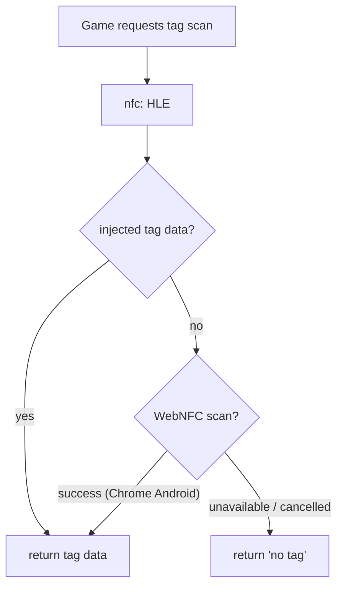

---

## 22. Companion App

Lightweight phone/watch app talking to the running emulator via local WebSocket (mDNS-discoverable).

| Feature | watchOS | Phone | iPad |
|---|---|---|---|
| Status / FPS | ✓ | ✓ | ✓ |
| Remote controller input | limited | ✓ | ✓ |
| Save state management | — | ✓ | ✓ |
| Secondary display (touchscreen region) | — | ✓ | ✓ |
| Screenshot gallery / mod management | — | ✓ | ✓ |

The secondary-display feature streams the framebuffer region the Switch would render to its touchscreen.

---

## 23. Developer Tooling

### Trace buffer

Lives in linear memory at `layout.traceBufferBase` (§4).

```c
// core/common/log.h — 24 bytes/event
typedef struct __attribute__((packed)) Trace_Event {
  uint64_t timestamp_ns;
  uint32_t event_type;    // TRACE_SVC, TRACE_GPU_CMD, TRACE_AUDIO_UNDERRUN, ...
  uint32_t thread_id;
  uint32_t payload[2];
} Trace_Event;

#define TRACE_BUFFER_CAPACITY 65536
// +0: write index (Int32, atomic fetch_add — the buffer is MULTI-WRITER TODAY:
//     CPU worker C and GPU worker TS both emit. Slot reservation must be an
//     atomic RMW; load-then-store lets two writers claim one slot. Torn reads
//     of an in-flight event are acceptable for diagnostics; lost events are not.)
// +4: pad  +8: Trace_Event array (ring: slot = fetch_add(1) % capacity)

void trace_emit(uint32_t event_type, uint32_t thread_id,
                uint32_t payload0, uint32_t payload1);
```

### Public interface for the Chrome extension

```typescript
// Exposed at boot: the memory object plus offsets (no separate SABs, §4)
window.__VOLAND_MEMORY__ = memory;                 // WebAssembly.Memory
window.__VOLAND_TRACE_METADATA__ = {
  version: 1, eventSizeBytes: 24, capacityEvents: 65536,
  traceBufferBase: layout.traceBufferBase,
  writeIndexOffset: 0, eventsOffset: 8,
  breakpointRegionBase: layout.breakpointRegionBase,
};
```

**Extension implementation note:** MV3 content scripts run in an isolated world and cannot see page globals. The extension must inject a main-world script (`world: "MAIN"` in its content-script registration) to read `window.__VOLAND_MEMORY__`. One sentence that saves a contributor a day.

The extension reads the trace buffer out-of-process directly from shared memory — zero overhead on the emulator during profiling.

### Hot-reload HLE (development builds only)

Debug Emscripten builds link the core as `MAIN_MODULE=1` with each HLE service as a `SIDE_MODULE=1`, allowing a single service to be recompiled and hot-swapped into a running tab without losing game state. Production builds are statically linked.

---

## 24. Build System

### CMake options

```cmake
option(CPU_BACKEND   "noop|interpreter|ballistic"          "noop")
option(GPU_BACKEND   "webgpu|vulkan|metal|d3d12|auto"      "auto")
option(AUDIO_BACKEND "wasapi|coreaudio|pipewire|none|auto" "auto")  # web: none (§14)
```

### WASM build flags

```cmake
if(EMSCRIPTEN)
  target_compile_options(switch_core PRIVATE
    -msimd128                 # REQUIRED: NEON → WASM SIMD; ~4x slowdown without
  )
  target_link_options(switch_core PRIVATE
    -s WASM=1
    -s WASM_BIGINT=1
    -s MEMORY64=1             # REQUIRED for Switch 1, not just 2 (§4)
    -s SHARED_MEMORY=1
    -s IMPORTED_MEMORY=1      # host creates the single WebAssembly.Memory (§16)
    -s INITIAL_MEMORY=5637144576   # ≈5.25GB; must equal the host's initial
    -s MAXIMUM_MEMORY=5637144576   # == INITIAL: growth disabled, views never detach
    -s ALLOW_MEMORY_GROWTH=0
    -s USE_PTHREADS=1
    -s PTHREAD_POOL_SIZE=8
    -s EXPORTED_FUNCTIONS='["_emulator_create","_emulator_destroy",
                             "_scheduler_tick","_layout_get",
                             "_cpu_get_reg","_cpu_set_reg"]'
    -s EXPORTED_RUNTIME_METHODS='["ccall","cwrap"]'
  )
endif()
```

Changes from v2: `IMPORTED_MEMORY` (the boot sequence creates the memory), `MAXIMUM_MEMORY` raised from 4GB to the full layout size and pinned to `INITIAL`, growth disabled, `MEMORY64` reclassified from Switch 2 prep to a Switch 1 requirement.

### Platform build targets

```cmake
# Web:      cmake -DCMAKE_TOOLCHAIN_FILE=$EMSDK/.../Emscripten.cmake \
#                 -DCPU_BACKEND=ballistic -DGPU_BACKEND=webgpu ..
# Desktop:  cmake -DCPU_BACKEND=ballistic -DGPU_BACKEND=auto ..
# Apple:    cmake -G Xcode -DCMAKE_SYSTEM_NAME=iOS ..
# Android:  cmake -DANDROID_ABI=arm64-v8a -DANDROID_PLATFORM=android-26 ..
```

---

## 25. Development Phases

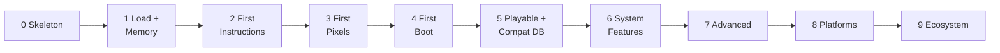

### Phase 0 — Skeleton

- [x] Repository structure and CMake setup
- [x] **Linear memory layout** (`layout.{h,c}`): all regions reserved, offsets exported (§4)
- [x] Emulator core wiring (emulator_create, layout_get)
- [x] No-op CPU backend honoring the exit-reason contract (§9)
- [x] SVC hook + stub HLE dispatcher
- [x] Web scaffolding: single-memory boot sequence, CPU worker instantiates core, layout handshake (§16)
- [x] COOP/COEP + SW reload path working end-to-end

Implemented, not yet build-verified: this repository's sandbox has no `emsdk`/`cmake`/C toolchain installed, so the Emscripten build (`switch_core.js`/`.wasm`) and the native CMake build have not actually been compiled and run here. `cpu.worker.ts` fails loudly with a real error (rather than a fake "ready") until `platform/web/public/core/switch_core.{js,wasm}` exists - see its header comment for the exact build + copy steps.

### Phase 1 — Load & Memory

- [ ] **Softmmu** (`vmm.{h,c}`): page tables, map/unmap/reprotect/query, read/write, guest_to_host (§5)
- [ ] Decrypted-NCA parsing (RomFS, ExeFS, npdm — no encryption handling per §1.6) + **NSO loader** (LZ4 segments) and process bootstrap per §12
- [ ] **TLS allocation + tpidrro_el0 plumbing** — IPC's transport; required before any sm: stub answers a real request
- [ ] Load executable sections into guest memory *through vmm mappings*
- [ ] Memory HLE (SetHeapSize, MapMemory, QueryMemory) as thin vmm layers
- [ ] Minimal IPC + sm: stub
- [ ] Input region + seqlock writer/reader (§18)
- [ ] User-facing error path for encrypted input → dumping guide

### Phase 2 — First Instructions

- [ ] Interpreter backend (partial ARM64), all memory access via vmm
- [ ] NRO loader — homebrew is this phase's proof of life
- [ ] **Guest thread scheduler** (§7): bounded run, exit reasons, wait objects, virtual time
- [ ] Threading + sync HLE (CreateThread, StartThread, SleepThread, WaitSynchronization) on the scheduler
- [ ] Basic IPC routing

### Phase 3 — First Pixels

- [ ] Minimal nvdrv stub (nvmap + channel submit) + **syncpoint skeleton over the GPU completion ring**
- [ ] NVDEC/VIC **syncpoint-signalling stub** (black frames that complete — cutscene titles deadlock without it, §13)
- [ ] Framebuffer-blit path: double-buffered slots + publish counters (§6)
- [ ] WebGPU renderer (texture upload + fullscreen quad), `Atomics.waitAsync` consumer
- [ ] **voland-cli headless runner** (Dawn offscreen, golden-image hashing) — the native test harness (§17)

### Phase 4 — First Boot

- [ ] **GPU command ring** (§13): versioned records, CPU-side decode, GPU-side drain
- [ ] Minimal shader path (stall-on-compile, no cache yet)
- [ ] **vi: + buffer queue (nvnflinger)** — the present contract; without it Phase 4 has no screen
- [ ] fsp-srv (RomFS on decrypted input), hid: **shared-memory writer (N independent npads + style bits — enables same-console multiplayer, §20)**, applet, time (virtual-time-backed)
- [ ] Audio ring + AudioWorkletProcessor output (§14)

### Phase 5 — Playable Core (+ Compatibility Database)

- [ ] Ballistic-x86 integration on desktop: region compilation, dispatcher, exit-code ABI (§10–11). This validates all dispatcher/block-cache/PTC infrastructure backend-agnostically; the WASM emitter slots in whenever upstream resumes it
- [ ] **Predecoded interpreter** for web: decode blocks once into a dense internal form (op index + extracted operands), execute the predecoded form. 2–4x over fetch-decode-execute, backend-independent, and its block discovery/invalidation is the same machinery the JIT dispatcher uses. This is the web execution path until Ballistic-WASM exists — treat it as a deliverable, not a stopgap
- [ ] PTC first cut (desktop, against ballistic-x86): content-hash keys, OPFS bytes, session compile
- [ ] Pipeline cache (OPFS, microcode-hash keys)
- [ ] Software TLB if profiling justifies it (§5)
- [ ] **Compatibility database — first cut.** As soon as any game runs, users need a public works/doesn't/hangs-at-X list.

### Phase 6 — System Features

- [ ] Save data (OPFS), settings (IndexedDB), library/settings UI
- [ ] Compatibility DB in the library UI
- [ ] Improved shader pipeline + ASTC transcode cache
- [ ] **Real video decode**: WebCodecs path per §13 (bitstream reconstruction, block-linear write-back, VIC)
- [ ] Stub upgrade map, first tier (§12): controller applet + swkbd overlays, set:sys locale, apm mode toggle, account profiles, caps screenshots

### Phase 7 — Advanced Features

- [ ] LayeredFS mods, amiibo
- [ ] **Mod repositories** (add-a-repo, §19): manifest fetch + SHA-256-verified install/update; guest-side content only; zero shipped repos, no CORS proxy
- [ ] **Save backup & sync framework** + Google Drive and OneDrive backends (§15) — depends only on Phase 6 OPFS saves; deliberately ahead of the companion server
- [ ] AOT pre-translation (opt-in per game; the answer to per-session compile cost, §11)
- [ ] Improved audio accuracy

### Phase 8 — Platform Expansion

- [ ] Desktop Qt GUI over the voland-cli core, Android Compose UI, iOS SwiftUI (if the JIT entitlement path remains viable); consent screens per CONSENT_FLOWS.md across all UIs
- [ ] Per-core-worker experiment, gated on single-worker profiling (§7)

### Phase 9 — Ecosystem & Polish

- [ ] WebRTC multiplayer (LDN) + **companion server v1** (signalling, companion sync backend, TURN pairing; COMPANION_API.md), companion apps
- [ ] **LAN-mode transport** (§20): bsd over OS sockets natively; WebRTC tunnel + broadcast fan-out on web
- [ ] **Server directory entries** (§19 schemaVersion 2) + per-title override sets and consent flow (§20) + bsd WS/WebTransport bridge backend
- [ ] Debug tooling (trace timeline UI, Chrome extension)
- [ ] Manual PTC export/import UI

---

## 26. Contributing

**If you know TypeScript/JavaScript:** start with the web platform layer. Everything there develops against the no-op backend. Begin with `platform/web/src/main.ts` and work outward.

**If you know C:** the highest-leverage early subsystems are `vmm` (§5) and the scheduler (§7) — they gate everything — followed by HLE services from the §12 priority list, using Ryubing's C# implementations as behavioral references.

**If you know compiler engineering:** the Ballistic WASM backend. Join the Pound Discord ([discord.gg/aMmTmKsVC7](https://discord.gg/aMmTmKsVC7)); the §10 contract items are the current integration questions.

### Code review requirements

- No merge without tests for HLE services
- No C++ in core, no exceptions. Third-party code in core/ is exactly one file: vendored single-file LZ4 (BSD) for NSO segment decompression (§12)
- No `any` in TypeScript
- All guest addresses are virtual unless the parameter says `guest_pa`; HLE memory access goes through vmm — reviewers reject direct guest-RAM pointer arithmetic outside `vmm.c`
- No per-frame data over postMessage
- **No code that decrypts Nintendo content. No server-side aggregation of user-derived data.** See §1.6.

### Reference implementations (read, do not fork)

| Project | Language | Study for |
|---|---|---|
| [Ryubing](https://github.com/Ryubing) | C# | HLE service behavior |
| yuzu (archived) | C++ | Maxwell command buffer format, GPU approach |
| dynarmic | C++ | ARM instruction semantics, edge cases, test suite |

---

## 27. Reference Implementations

### Ballistic

- Repo: [github.com/pound-emu/ballistic](https://github.com/pound-emu/ballistic) · Discord: [discord.gg/aMmTmKsVC7](https://discord.gg/aMmTmKsVC7)
- Status: working barebones x86 backend; WASM backend in design
- Voland's integration contract: §10

### Nintendo Switch hardware

| Component | Details |
|---|---|
| CPU | ARM Cortex-A57, 4 cores (3 for applications), 1.02GHz docked |
| GPU | NVIDIA Maxwell, 768MHz docked |
| RAM | 4GB LPDDR4 (~3.2GB application-usable) |
| Guest VA space | 36-bit (1.x) / 39-bit (2.0+) |
| NFC | Type A/B (amiibo) |

### Specifications

- ARM ARM A-profile: developer.arm.com/documentation/ddi0487
- WASM binary format: webassembly.github.io/spec/core/binary
- memory64 / SIMD / threads proposals: github.com/WebAssembly/{memory64,simd,threads}
- WebGPU / WGSL: gpuweb.github.io/gpuweb

---

## 28. Risk Register

| Risk | Severity | Likelihood | Mitigation / Notes |
|---|---|---|---|
| Nintendo legal action | High | Medium | §1.6 posture (no decryption, no cache aggregation, no IP redistribution) puts Voland on the safer side of the line that killed Yuzu/Citra. Reduced, not zero. Maintainer should not host on personal infrastructure. Contributors WILL propose decryption patches; they must be rejected. |
| Apple revokes `dynamic-codesigning` for sideloads | High | Low–medium | Apple-native ports fall to interpreter-only (too slow for AAA). Web platform unaffected — and the web *is* the primary target, which caps this risk's blast radius. |
| **memory64 bounds-check overhead** | Medium | High (it exists; magnitude varies) | ~5–15% on memory-heavy code, engine-dependent — measurable per engine now that memory64 is cross-browser. Mitigation: hot host structs in the low 4GB (§4); named escape hatch is multi-memory, gated on toolchain support (§4). Separately: the ~16GB per-memory browser cap is a hard Switch 2 constraint (§4). |
| ~5.25GB shared-memory allocation fails on constrained devices | Medium | Medium | Detect at boot, fail with a specific message directing to native builds (§16). No graceful degradation is possible — the address space is the requirement. |
| Softmmu overhead makes web performance unplayable for heavy titles | Medium | Medium | Two-load walk is the floor; software TLB and contiguous-heap fast paths are the measured escalations (§5). If insufficient, lighter titles remain viable on web and heavy titles are a native-build recommendation. |
| Ballistic-WASM stays paused indefinitely (IR instability; currently paused at maintainer's request) | Medium–high for web perf | **Realized** — it is paused now | Web runs the predecoded interpreter (§25 Phase 5) with no JIT timeline. Mitigations: file §10 items as design input while the IR is malleable; validate all dispatcher/PTC infrastructure on ballistic-x86 desktop so the WASM emitter drops into finished plumbing. NOT a mitigation: forking, vendoring IR headers, or a homegrown emitter against the unstable IR — permanent divergence against a moving upstream. |
| Ballistic-x86 doesn't reach coverage in time | Medium | Medium | Interpreter keeps everything functional on desktop too; the project ships without it. Performance, not existence, is what's at stake. |
| Ballistic upstream rejects §10 contract items when WASM work resumes | Medium | Low–medium | Filed early as design input (see row above) precisely so this surfaces before anything is built against them. |
| Per-session `WebAssembly.compile` of PTC bytes is too slow at launch for large titles | Low–medium | Low | Baseline compile is tens of MB/s; if launch stalls appear, compile lazily per region on first execution instead of bulk-at-boot. AOT (Phase 7) shifts the balance further. |
| WebGPU rendering differences across the three implementations (Dawn / wgpu / WebKit) | Medium | Medium | WebGPU is Baseline (Jan 2026) and worker-context support is verified on all three engines (§13); remaining gaps are Firefox Linux/Android rollout and per-implementation rendering differences. Boot-time capability check; golden-image tests run per engine in CI. |
| COEP `require-corp` breaks third-party assets | Medium | Medium | First-party assets only; documented for self-hosters; SW re-injects headers on cached responses (§16). |
| SW COOP/COEP injection first-visit reload confuses users/hosters | Low | Medium | Guarded single-reload in boot (§16); deployment docs say "set real headers." |
| Maintainer burnout | Medium | Medium | Multi-year effort; variable cadence acceptable; contributor recruitment starts Phase 5, not deferred. |
| ASTC transcoder bugs corrupt rendering | Low | Low | Cache key includes transcoder version; bump forces rebuild. |
| WebRTC LDN timing differs from WiFi | Low–medium | High | Documented limitation; frame-perfect multiplayer titles may differ. Not a project-killer. |

Removed from v2: the dynarmic row (dependency dropped), the frame-interpolation implications (feature deleted), and the Xbox rows (platform demoted to exploratory, §17). Added: memory64 overhead, softmmu performance, Ballistic contract rejection, PTC compile latency — the risks the v2 architecture couldn't see because it hadn't made the §1-Overview load-bearing decisions explicit.

The format of this register is "what could go wrong," not "what will go wrong." The two genuine existential concerns remain Nintendo legal action and the Apple JIT entitlement; §1.6 addresses the first structurally, and web-primacy contains the second.

---

*Document version: 3.19.0*
*Last updated: July 2026*
*Maintained by: proxy-alt*

### Changelog v3.18 → v3.19 (summary)

- **§16 bug fix, verified against shipping Chromium:** the Required HTTP headers COOP value corrected from `same-origin-allow-popups` back to strict `same-origin`. Tested directly (not assumed): `same-origin-allow-popups` + `require-corp` never yields `crossOriginIsolated`, regardless of COEP; only strict `same-origin` does. The `-allow-popups` variant was chosen in an earlier revision on the theory that it bought both cross-origin isolation and OAuth-popup opener retention — it does neither jointly, and this document's own §15/§16 OAuth callback design (`BroadcastChannel` + PKCE state nonce, not `window.opener`) never actually needed the opener-retention property in the first place. `platform/web/vite.config.ts`, `platform/web/sw.ts`, and `platform/web/src/main.ts` corrected to match. `npm run e2e` (Playwright, headless Chromium) now asserts `crossOriginIsolated === true` directly against a real build so this class of regression fails CI instead of silently shipping.

### Changelog v3.17 → v3.18 (summary)

- **§7: per-core workers repriced as an architecture fork** — full demolition list of single-thread-by-construction invariants (vmm walks vs unmap as the hardest: quiesce/RCU, not locks); **hybrid named**: execution workers + one kernel worker, HLE stays single-threaded, page-table mutation quiesced at existing block-entry yield points.
- **§11: block-cache single-writer invariant documented** (enforced by synchronous-WASM event-loop construction, not code); funcref-table single-worker sentence connected to its Phase 8 contradiction.
- **§23: trace buffer fixed present-tense** — multi-writer today (CPU C + GPU TS); write index specified as `fetch_add` slot reservation.
- **§12: hid sampling-number protocol mandated from day one** — decorative under green threading, load-bearing under the fork; retrofit is the worst option.

### Changelog v3.16 → v3.17 (summary)

- **§5: `vmm_guest_to_host` borrow semantics** — handler-scoped, never stored (green threading protects only within a handler; storage outlives the guarantee and Phase 8 voids it); debug-build borrow tracking asserts on overlapping map/unmap and at handler exit; GPU ring exempted by design (physical ranges, hardware-DMA semantics).
- **§7: exclusive-monitor starvation guard** — exclusive pairs never split across blocks (JIT structurally cannot preempt the window), interpreter yields at monitor-clear safe points with a cap, scheduler grace window after consecutive STLXR failures.
- **§13: emdawnwebgpu gate sharpened** — the audit class is 32-bit truncation in generated glue (`>>>0`, `|0`, HEAPU32) corrupting >4GB offsets, not Number precision; data-pointer paths named.
- **§14: dynamic rate control** — worklet PI controller on ring-fill error (±1%, setpoint half-capacity) absorbs DAC/virtual-clock drift; underrun-silence demoted to backstop; native drainers bound by the same conformance contract.
- **§20: bundled one-command cert utility** for raw-LAN-IP companion self-hosters.

### Changelog v3.15 → v3.16 (summary)

- **§3 (new): the core/platform boundary principle** — defer mechanism, never policy; guest platform-invisibility as the test; conformance contracts at every deferral boundary; pre-rejected leaks (SIMD semantics, platform timing, OS auto-backup of saves); falsifiability via per-platform differential/golden CI.
- **§5: native fastmem named as the intersection-targeting cost** and gated as an escape hatch (profiling-gated, Phase 8+, bifurcates JIT memory lowering) alongside Tier 2 Vulkan and per-core workers.

### Changelog v3.14 → v3.15 (summary)

- **§13: Tier 1 unified across web too** — one C renderer against standard `webgpu.h`, compiled natively (Dawn/wgpu-native) and to WASM via **emdawnwebgpu** (Emscripten's `-sUSE_WEBGPU` rejected as unmaintained), shipped as a second module in the GPU Worker importing the shared memory. Eliminates the TS/C dual-renderer drift v3.13 implicitly created. Old "no webgpu.h on web" rule narrowed to its true content: no WebGPU bindings in the CPU Worker's core module. Two Phase 3 spike gates: emdawnwebgpu × memory64 × shared-memory import (hard gate, TS drainer as clean fallback), and measured per-call marshalling with render-bundle/batching mitigations designed in.

### Changelog v3.13 → v3.14 (summary)

- **§17 (new): UI strategy — share logic, not pixels.** The 4-codebases/10-targets arithmetic vs cross-platform toolkits (RN, Flutter, bespoke) stated as the canonical redirect; duplication attacked via schema-driven settings, consent-flow state machines with per-UI conformance tests, and core-owned models. Compose Multiplatform recorded as the sole defensible Phase 8 consolidation option (retires Qt for a bundled JVM).

### Changelog v3.12 → v3.13 (summary)

- **§13: renderer matrix collapsed to two tiers** — Tier 1 `GPU_BACKEND_WEBGPU_NATIVE` (Dawn/wgpu-native) on every native platform, reusing the web build's command-stream logic and its compute-shader fallbacks for WebGPU's Maxwell gaps; Tier 2 hand-written Vulkan as a measured performance backend (Win/Linux/Android; MoltenVK only if profiling demands). Hand-written Metal and D3D12 deleted; decompiler outputs reduced to WGSL (primary) + SPIR-V (Tier 2); msl/hlsl backends removed from the tree.
- **§17: Qt affirmed over WinUI 3 + GTK** — UI codebase count is a security variable (consent-flow reimplementation); all UIs render consent screens from normative `docs/CONSENT_FLOWS.md`.
- **§17 (new): voland-cli** — Qt-free CLI as the first desktop artifact, mandated by the Phase 3 headless golden-image/differential test harness; `run`/`verify-dump`/`ptc-precompile`/`cache`/`save-export`; Phase 8 Qt GUI is a frontend over the CI-hardened core; launcher-frontend integration point.

### Changelog v3.11 → v3.12 (summary)

- **§16 (new): kiosk build** — build-time flagged, self-host-only artifact for creators embedding previews of their own homebrew: pinned auto-boot title, consent surfaces compiled out (which is what makes operator-scoped embedding safe), static `kiosk.json` configuration, saves per kiosk origin. **NRO-only loader** — the structural line keeping a hosted-title player homebrew-only rather than a piracy-portal frontend. No postMessage in this build either: the no-window-messaging rule is unconditional; the use case is declarative. **Embedder COI burden documented** (top-level COOP+COEP + `allow="cross-origin-isolated"` delegation; standalone-page flow recommended over iframing); IntersectionObserver self-pause closes the pause-API objection; link parameters unrecognized in kiosk.

### Changelog v3.10 → v3.11 (summary)

- **§16: no window messaging API** — no postMessage configuration surface, ever (URL params already serve legitimate senders; the channel's only additions are attacker-shaped). COOP's opener-severance documented as load-bearing; **`frame-ancestors 'none'` added** (closes embedding — both the message channel and consent-prompt clickjacking, which the §19/§20 consent architecture cannot survive). Structural rule: zero window/document `message` listeners; OAuth popup callback via BroadcastChannel + PKCE state nonce.

### Changelog v3.9 → v3.10 (summary)

- **§16 (new): link parameters** — exactly two (`?add-repo=`, `?join=`), prefill-never-perform, references-not-payloads, external-source labeling, never over active gameplay; all consent-bearing surfaces (servers, overrides, CA, bridges, sync) explicitly not URL-addressable.

### Changelog v3.8 → v3.9 (summary)

- **§19 rule 6 / §20: bridge destination approval specified** — default-deny per host; routed set = manifest scope ∩ approved set; approval unit is the (title, game-server, bridge) triple auto-computing the exact endpoint intersection (large bridges never produce large prompts); records live in the existing per-title override sets; manual per-host approval as the advanced path; **domain grouping display-only — group-level approval toggles prohibited** (wildcard consent in a costume).

### Changelog v3.7 → v3.8 (summary)

- **§19/§20: third-party bridges listable** — `bridge` capability added to server directory entries (additive within schemaVersion 2): repo-listed relays that make native-only community servers web-reachable, under the TURN precedent. Mandatory destination scoping (`bridgeFor`, exact hosts, no wildcards, client-enforced — open proxies refused at parse time); automatic composition with in-scope `game-server` entries; dual-operator consent naming both parties; plaintext visibility stated honestly (TLS guest traffic transits as ciphertext, plain-socket protocols are bridge-readable). Voland operates and recommends no relay.

### Changelog v3.6 → v3.7 (summary)

- **§19 (new): server directory entries (manifest schemaVersion 2)** — repos may advertise `signalling`/`turn`/`game-server` infrastructure as **zero-trust directory listings**: no repo-trust laundering, no auto-connect, capabilities verified by handshake where one exists and labeled unverified otherwise, and a hard rule that save-sync backends never populate from repos. First-use disclosures specified per capability; CA bytes hash-verified before the consent prompt renders; static TURN credentials made inexpressible (ephemeral vending via companion API only).
- **§20 hook upgraded:** sfdnsres overrides become **per-title sets** (provenance-tracked, runtime-scoped, one-toggle revert) with an explicit consent flow; CA trust confirmed guest-`ssl:`-only. **Web transport reality stated:** raw TCP/UDP game servers are browser-unreachable; `bsd:` gains a third transport backend (server-terminated WS/WebTransport bridge); entries declare `transports` and web clients filter — native-only entries display as such, never as silent failures. **Fail-closed egress added as the load-bearing rule:** internet-capable `bsd:` backends reachable only for destinations in the active entry's overrides — default-deny, no fall-through to real Nintendo hosts, CA exercise confined to entry-named hosts by construction. **Re-consent on change:** endpoint/override/CA edits in a repo update deactivate the entry and re-prompt with a diff. `nifm` honest-connectivity rule extended to active server entries (§12).
- **§25:** Phase 9 entry.

### Changelog v3.5 → v3.6 (summary)

- **§19 (new): mod repositories (add-a-repo model).** URL + `repository.json` manifest, SHA-256-verified install/update, `sourceRepo`/`targetGameVersions` provenance; `cheats` type and **mandatory `buildId` matching for exefs-patch/cheats entries** (build ID from §12 bootstrap is authoritative; version strings are display-only). Three hard rules: Voland ships zero repos and no CORS proxy (§1.6 — distributing/curating Nintendo-derived mod content); **guest-side content only, host-side plugin code categorically excluded** (no page-context sandbox; would expose OPFS saves + §15 cloud OAuth tokens); repos must be CORS-enabled. §1.5 non-goal + Phase 7 entry added.

### Changelog v3.4 → v3.5 (summary)

- **§20 community-server hook: title-specific UGC category added** — design/creator IDs, dream addresses, level codes: real-code interop impossible by construction (Nintendo-DB keys); Voland-namespace variants blocked by the per-game-protocol non-goal and the no-save-crypto-in-repo line; save sync + LDN + the DNS hook cover the coverable parts. Canonical redirect target for recurring proposals.

- **§20 surface 3 corrected and split:** "internet play falls out for free" replaced with the honest taxonomy — distant *local-wireless* play (RyuLDN pattern, works via existing relay), **LAN mode** (new: pluggable `bsd:` transport — OS sockets natively, WebRTC tunnel + UDP-broadcast fan-out on web), and Nintendo's online stack (stubbed, plus the explicit **hard rule: Voland never connects to Nintendo's real servers**, zero endpoints shipped).
- **§20 (new): community-server hook** — `sfdnsres` host-override table + user-imported CAs, empty by default; per-game server support remains a non-goal.
- **§12/§18/§25:** controller applet added to the web-native stub tier (a blocking library applet — couch multiplayer can't start player 2 without it); npad style negotiation specified in the hid writer; LAN-mode transport at Phase 9.
- **§1.5 non-goal wording fixed** to match (no NSO-modes overpromise).

### Changelog v3.3 → v3.4 (summary)

- **§1.6 (new): operator-vs-data rule** — user-hosted/third-party services on user-owned data are permitted; anything serving Nintendo-derived data is banned regardless of host. Pre-answers user-hosted bcat mirrors and cache-sharing servers (non-goals updated to match).
- **§15 (new): save backup & sync** — provider-agnostic `SaveSyncBackend` (list/pull/push + monotonic revision, conflict = keep both); Google Drive (`drive.file`/appdata) and OneDrive (`approot`) as the zero-infrastructure primary path; PKCE client-ID realities documented (self-hosters register their own); optional E2E passphrase encryption; pushes hook the save-sync worker's write-quiesce point. olsc IPC stays stubbed forever — the feature lives here.
- **§20: signalling-server contradiction resolved** — signalling is a function of the new **user-hosted companion server** (`companion/`: Node.js + SQLite; signalling/room codes, companion sync backend, TURN pairing, reserved presence channel; no Voland instance, no default URL, no telemetry). Web-platform template requirements mandated: CORP/CORS under COEP, TLS-or-localhost, Private Network Access preflight. Protocol versioned in `docs/COMPANION_API.md`.
- **§2/§25:** `companion/` and `platform/web/src/sync/` in the tree; sync framework + first providers at Phase 7 (ahead of the Phase 9 companion server, on purpose); companion server v1 at Phase 9.
- **§20 reframed to three multiplayer surfaces:** same-console (hid multi-npad, Phase 4), local wireless LDN (WebRTC), internet play (LDN-over-WebRTC + remote room code — not a new subsystem). §12 hid writer gains the explicit N-independent-npad obligation. §28 non-goal added: NPLN/Pia/NSO online-stack emulation.

### Changelog v3.2 → v3.3 (summary)

- **§13 (new): NVDEC/VIC video decode** — syncpoint-signalling stub mandated at Phase 4 (cutscene titles deadlock otherwise); real decode via WebCodecs `VideoDecoder` in the GPU Worker, riding the existing command + completion rings; platform-independent C bitstream reconstruction (`nvdec_bitstream.{h,c}`); block-linear write-back; VIC HLE; native backends per the drainer pattern; explicit no-FFmpeg-WASM fallback policy.
- **§12 (new): stub upgrade map** — three tiers: web-native implementations (swkbd overlay, offline web applet in a sandboxed iframe, set:sys locale, caps/grc capture, psm battery), correctness-bearing (apm, nifm, mii, account), and deliberately-stubbed-with-reasons (prepo, bcat, olsc/npns).
- **§12 revision:** Mii database changed from "stub empty" (v3.2) to a synthesized procedural default DB — empty databases break Mii-consuming titles.
- **§25:** Phase 4 gains the NVDEC stub; Phase 6 gains real video decode + the first stub-upgrade tier.

### Changelog v3.1 → v3.2 (summary)

- **§12 bug fix:** SVC dispatch corrected to the Horizon ABI — syscall ID is the SVC **immediate** (`swi`), not X8; per-SVC register ABI (args W0–W7/X0–X7, Result in W0) stated; handlers use the §8 register-file struct.
- **§12 (new): the call surface specified** — per-thread 0x200-byte TLS with the IPC command buffer in its first 0x100 bytes and `tpidrro_el0` set on context switch; HIPC parsing (handle + buffer descriptors, all buffer access via `vmm_guest_to_host`); CMIF (SFCI/SFCO, command IDs) with **domains** designed in from day one; C service-object pattern (interface struct + sorted command table); per-process handle table with generation counters and pseudo-handles.
- **§12 (new): process bootstrap** — NSO (LZ4) + NRO loaders added to the tree (LZ4 becomes core's single vendored dependency); npdm-driven address-space setup; GetInfo region queries answered from vmm's layout; main-thread entry ABI (X0=0, X1=main thread handle).
- **§12/§13/§25: vi: + buffer queue (nvnflinger) added** — the present path games actually use; omitted entirely from v2–v3.1, without which Phase 3/4 could not display a frame. nvdrv row expanded to its real ioctl surface.
- **§4/§6/§13 (new): GPU completion ring** — the missing GPU→CPU direction; syncpoint/fence completions and the vsync event flow through it into kernel wait objects.
- **§12/§18/§25: hid: respecified as a shared-memory service** — the deliverable is the HID shared-memory writer (input region → guest-visible npad rings), not per-request reads.
- **§12 (new): SVC table gains condition variables (0x1C/0x1D), events, shared/transfer memory;** Result encoding macro documented.
- **§12 (new): firmware-free policy** (synthesized fonts/tzdb, stubbed Mii DB) and **unimplemented-surface policy** (never silent success; explicit `_stub` allowlist; unknown-command trace events feed the compatibility DB).

### Changelog v3.0 → v3.1 (summary)

- **§2/§6/§11:** compiler moved from SharedWorker to a dedicated worker — `WebAssembly.Module` structured-clone is restricted to the agent cluster, and SharedWorkers are a separate cluster; cross-tab sharing exists only at the byte level (OPFS). Save-sync SharedWorker annotated async-OPFS-only (`createSyncAccessHandle` is dedicated-worker-only).
- **§10/§11:** region modules import the core module's shared `funcref` table (second permitted non-function import); dispatcher `call_indirect` is in-wasm with zero JS on the hot path; block cache stores table indices; synchronous `new WebAssembly.Instance` noted.
- **§8:** `CPU_Register_File` struct + `get_register_file` — HLE reads registers directly instead of paying an indirect call per register per SVC.
- **§5:** vmm gains `static inline` walk helpers for the interpreter (checked `Error` API stays for HLE); 1-entry interpreter TLB noted.
- **§14/§16:** audio corrected to the Switch-native 48kHz end to end; native backends unified as ring drainers, `submit_frames` deleted.
- **§4/§28:** memory64 status updated to cross-browser (Wasm 3.0); ~16GB per-memory cap recorded as a hard Switch 2 constraint; multi-memory documented as the gated escape hatch.
- **§13/§28:** WebGPU-in-worker verified on Chromium, Firefox, and Safari 26 (transferred OffscreenCanvas + device + render pass in a DedicatedWorker); kept as a per-engine CI regression guard. C `GPU_BACKEND_WEBGPU` explicitly declared nonexistent — the web GPU backend is the TS ring-drainer.
- **§15:** FSA pickers documented as a permanent Chromium-only standards split; per-session `<input type=file>` fallback specified as a requirement for Firefox/Safari, which can now otherwise run Voland.
- **§16:** stale browser guidance in the WebGPU fatal-error string replaced with post-Baseline reality.

### Changelog v2 → v3 (summary)

- **§4 (new):** guest RAM moved inside a single shared, memory64, fixed-size `WebAssembly.Memory`; standalone SABs eliminated; memory64 reclassified as a Switch 1 requirement.
- **§5 (new):** softmmu with two-level page tables promoted to Phase 1; all guest addresses virtual; HLE accesses memory via vmm, never the CPU backend.
- **§7 (new) + §8:** bounded `run(state, budget) → exit_reason`; green-threaded guest scheduler; per-thread `CPU_State`; exclusive monitors via context-switch clearing; virtual time. `run_until`, `halt`, register index 31 semantics fixed.
- **§10–11:** region-granularity modules with funcref-table chaining; no function imports (v2's §4/§7b contradiction resolved); exit-code ABI instead of traps; caches keyed by code hash, not GVA; OPFS stores bytes — per-session compile cost stated plainly.
- **§13:** uber-shader strategy deleted as infeasible for Maxwell; async compile with stall/skip + persistent pipeline cache; PTX→SASS terminology fixed; frame interpolation removed (no Maxwell motion vectors exist); GPU command ring specified; decompilation placed in the GPU Worker.
- **§14:** Audio Worker deleted; worklet reads the ring directly; ring specified in frames; underrun policy defined.
- **§6, §18:** frame handoff double-buffered and pipelined (`waitAsync` on the GPU side); input moved from per-rAF postMessage to a seqlock region; postMessage restricted to lifecycle.
- **§16:** boot sequence rebuilt around the single memory + layout handshake; SW COOP/COEP first-visit reload specified; hidden-tab auto-pause policy written down.
- **§17:** Xbox demoted to exploratory. dynarmic dropped everywhere; core is now C-only with no exceptions.
- **§23:** MV3 main-world injection requirement documented for the trace extension.
